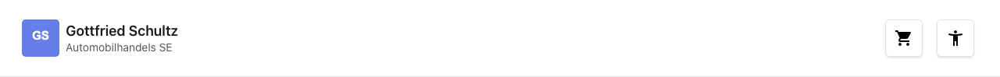
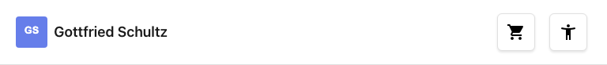
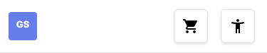

# Feature Documentation: Header

**Created:** 2026-02-14
**Requirement:** REQ-001-Header
**Language:** EN
**Status:** Implemented

---

## Overview

The Application Header is a reusable component displayed on all pages of the application. It contains the company logo with name, a shopping cart icon with badge and dropdown, and an accessibility menu for adjusting font size, contrast, and animations.

---

## User Guide

### Step 1: View header

**Description:** The header is automatically displayed when any page loads. On the left side is the company logo with the name "Gottfried Schultz Automobilhandels SE". On the right side are the shopping cart icon and the accessibility button.

### Step 2: Shopping cart icon

**Description:** The shopping cart icon displays a badge with the number of items in the cart. When there are 0 items, no badge is shown. When there are more than 99 items, "99+" is displayed. Clicking the icon opens a cart dropdown with a preview of the cart contents.

### Step 3: Open accessibility menu

**Description:** The user clicks the accessibility button (accessibility icon). A dropdown menu opens with the following settings:

- **Font size:** Small, Normal, Large, Extra Large
- **High contrast:** On/Off toggle
- **Reduced motion:** On/Off toggle

### Step 4: Change settings

**Description:** Changes are applied immediately and saved to LocalStorage. On the next visit, settings are automatically restored. The system preference for reduced motion is respected on initial load.

---

## Responsive Views

### Desktop (1280x720)

- Logo + company name (2 lines: name + subtitle)
- Cart icon and accessibility button on the right

### Tablet (768x1024)

- Logo + company name (1 line, no subtitle)
- Same button arrangement

### Mobile (375x667)

- Logo only (company name hidden)
- Compact button arrangement

---

## Accessibility

- **Keyboard navigation:** All buttons reachable via Tab, menus open with Enter/Space
- **Screen reader:** ARIA labels on all interactive elements ("Accessibility Settings", "Shopping Cart, X items")
- **Color contrast:** WCAG 2.1 AA compliant, supports high contrast mode
- **Focus styles:** Visible focus ring with `:focus-visible`
- **Reduced motion:** Transitions disabled when `prefers-reduced-motion: reduce` is active
- **Semantic HTML:** `<header role="banner">` as landmark

---

## Technical Details

| Property | Value |
|----------|-------|
| Container Component | `HeaderContainerComponent` |
| Cart Icon Component | `CartIconComponent` |
| Accessibility Menu Component | `AccessibilityMenuComponent` |
| Accessibility Store | `AccessibilityStore` |
| Cart Store | `CartStore` |
| LocalStorage Key | `accessibility-settings` |

### Data Flow

1. App starts → `AccessibilityStore.loadFromStorage()` loads settings from LocalStorage
2. Store applies `data-font-size`, `data-high-contrast`, `data-reduced-motion` to `<html>` element
3. CSS variables react to the data attributes
4. User changes setting → Store updates → LocalStorage saved → DOM updated

### Font Sizes

| Level | Value | Label DE | Label EN |
|-------|-------|----------|----------|
| `small` | 14px | Klein | Small |
| `normal` | 16px | Normal | Normal |
| `large` | 18px | Groß | Large |
| `x-large` | 20px | Sehr groß | Extra Large |
