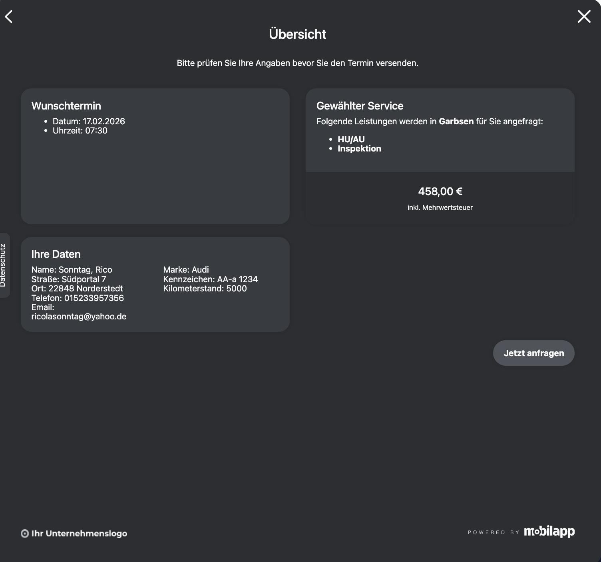

# REQ-002: Ablaufkomplett - Service-Buchungsablauf

**Status:** 📝 Draft
**Priority:** High
**Type:** Functional
**Created:** 2026-02-12
**Author:** Claude Code

---

## 1. Overview

### 1.1 Purpose
Kompletter Service-Buchungsablauf für Werkstatttermine. Der Benutzer durchläuft einen Wizard mit 10 Schritten: Markenauswahl → Standortwahl → Serviceauswahl → Optionen → Warenkorb → Terminwahl → Kundendaten → Bemerkungen → Übersicht → Buchungsbestätigung.

### 1.2 Scope
**Included:**
- Wizard-basierter Buchungsablauf
- Marken- und Standortauswahl
- Service-Auswahl mit Optionen (Modal)
- Warenkorb-Funktionalität
- Terminauswahl (Schnellauswahl + Kalender)
- Kundendaten-Formular
- Bemerkungen/Anmerkungen
- Buchungsübersicht und Absenden

**Excluded:**
- Bezahlung (kein Payment-Gateway)
- Benutzerregistrierung/Login
- Backend-Integration (Click-Dummy mit statischen Daten)

### 1.3 Related Requirements
- REQ-001: Header (wird auf allen Seiten verwendet)

---

## 2. User Story

**Als** Kunde
**möchte ich** einen Service-Termin für mein Fahrzeug buchen
**damit** ich meine Inspektion, HU/AU oder Räderwechsel bequem online planen kann.

**Acceptance Criteria:**
- [ ] AC-1: Benutzer kann Fahrzeugmarke auswählen (Audi, BMW, Mercedes-Benz, MINI, Volkswagen)
- [ ] AC-2: Benutzer kann Standort auswählen (3-5 Standorte pro Marke)
- [ ] AC-3: Benutzer kann Services auswählen (HU/AU, Inspektion, Räderwechsel)
- [ ] AC-4: Benutzer kann Service-Optionen konfigurieren (z.B. Einlagerung)
- [ ] AC-5: Benutzer sieht Warenkorb mit ausgewählten Services
- [ ] AC-6: Benutzer kann Schnelltermin oder Kalendertermin wählen
- [ ] AC-7: Benutzer kann Kundendaten eingeben (validiert)
- [ ] AC-8: Benutzer kann Bemerkungen hinzufügen
- [ ] AC-9: Benutzer sieht Zusammenfassung vor Absenden
- [ ] AC-10: Benutzer kann Anfrage absenden

---

## 3. Preconditions

### 3.1 System
- Angular App läuft
- Routing konfiguriert
- Header-Component verfügbar (REQ-001)

### 3.2 User
- Keine Authentifizierung erforderlich
- JavaScript aktiviert
- Moderner Browser (Chrome, Firefox, Safari, Edge)

### 3.3 Data
- Marken sind konfiguriert (statisch)
- Standorte pro Marke sind konfiguriert (statisch)
- Services sind konfiguriert (statisch)
- Termine sind verfügbar (statisch generiert)

---

## 4. Main Flow

### Ablaufdiagramm

```
┌─────────────────────────┐
│ 1. Markenauswahl        │
│    /buchung/marke       │
└───────────┬─────────────┘
            ▼
┌─────────────────────────┐
│ 2. Standortwahl         │
│    /buchung/standort    │
└───────────┬─────────────┘
            ▼
┌─────────────────────────┐
│ 3. Serviceauswahl       │◄──┐
│    /buchung/services    │   │
└───────────┬─────────────┘   │
            ▼                 │
┌─────────────────────────┐   │
│ 4. Service-Optionen     │───┘ (Modal, zurück zu Services)
│    [Dialog/Modal]       │
└───────────┬─────────────┘
            ▼
┌─────────────────────────┐
│ 5. Warenkorb            │
│    (Teil von Services)  │
└───────────┬─────────────┘
            ▼
┌─────────────────────────┐     ┌─────────────────────────┐
│ 6. Terminauswahl        │────►│ 7. Kalender             │
│    /buchung/termin      │     │    (individuelle Wahl)  │
└───────────┬─────────────┘     └───────────┬─────────────┘
            │◄──────────────────────────────┘
            ▼
┌─────────────────────────┐
│ 8. Kundendaten          │
│    /buchung/kundendaten │
└───────────┬─────────────┘
            ▼
┌─────────────────────────┐
│ 9. Bemerkungen          │
│    /buchung/bemerkungen │
└───────────┬─────────────┘
            ▼
┌─────────────────────────┐
│ 10. Übersicht           │
│    /buchung/uebersicht  │
│    → "Jetzt anfragen"   │
└─────────────────────────┘
```

---

**Schritt 1: Markenauswahl**
- **Route:** `/buchung/marke`
- **User:** Sieht Überschrift "Welche Fahrzeugmarke fahren Sie?" und 5 Marken-Buttons
- **System:** Zeigt Audi, BMW, Mercedes-Benz, MINI, Volkswagen als große Buttons
- **Expected:** Nach Klick wird Marke im Store gespeichert, Weiterleitung zu Schritt 2


---

**Schritt 2: Standortwahl**
- **Route:** `/buchung/standort`
- **User:** Sieht "An welchem Standort dürfen wir Sie begrüßen?" und Standort-Buttons
- **System:** Zeigt 3-5 Standorte basierend auf gewählter Marke
- **Expected:** Nach Klick wird Standort gespeichert, Weiterleitung zu Schritt 3


**Standorte pro Marke:**

| Marke | Standorte |
|-------|-----------|
| Audi | München, Hamburg, Berlin, Frankfurt, Düsseldorf |
| BMW | Stuttgart, Köln, München, Berlin, Hamburg |
| Mercedes-Benz | Stuttgart, München, Frankfurt, Düsseldorf, Berlin |
| MINI | Garbsen, Hannover Südstadt, Steinhude |
| Volkswagen | Wolfsburg, Hannover, Berlin, München, Hamburg |

---

**Schritt 3: Serviceauswahl**
- **Route:** `/buchung/services`
- **User:** Sieht "Welche Services möchten Sie buchen?" und Service-Cards
- **System:** Zeigt HU/AU, Inspektion, Räderwechsel mit Icons und Beschreibungen
- **Expected:** Klick auf Service öffnet ggf. Optionen-Modal, mehrere Services können gewählt werden


**Verfügbare Services:**

| Service | Icon | Beschreibung | Hat Optionen |
|---------|------|--------------|--------------|
| HU/AU | 🕐 (Tacho) | Jetzt Ihren Termin für eine gesetzliche HU/AU vereinbaren! | Nein |
| Inspektion | 🔧 | Lassen Sie Ihre fällige Inspektion hier durchführen! Buchen Sie jetzt einen Termin. | Nein |
| Räderwechsel | ⚙️ (Felge) | Kommen Sie zu uns für Ihren Räderwechsel - inkl. optionaler Einlagerung! | Ja |

---

**Schritt 4: Service-Optionen (Modal)**
- **Trigger:** Klick auf Service mit Optionen (z.B. Räderwechsel)
- **User:** Sieht Modal mit Service-Details und Checkbox-Optionen
- **System:** Zeigt Optionen wie "Räderwechsel ohne Einlagerung" / "Räderwechsel mit Einlagerung"
- **Expected:** Nach "Bestätigen" wird Service mit gewählter Option zum Warenkorb hinzugefügt


**Räderwechsel-Optionen:**
- [ ] Räderwechsel ohne Einlagerung
- [ ] Räderwechsel mit Einlagerung

---

**Schritt 5: Warenkorb**
- **Teil von:** Serviceauswahl-Seite (unten eingeblendet)
- **User:** Sieht "Sie haben X Services ausgewählt" mit Einkaufswagen-Icon
- **System:** Zeigt Liste der gewählten Services, "Weiter" Button wird aktiv
- **Expected:** Klick auf "weiter" führt zu Terminauswahl


---

**Schritt 6: Terminauswahl (Schnellauswahl)**
- **Route:** `/buchung/termin`
- **User:** Sieht "Wählen Sie den für Sie passenden Tag und Uhrzeit aus"
- **System:** Zeigt 4 Schnelltermin-Vorschläge (z.B. Fr 13.02.2026 07:30, Fr 13.02.2026 18:00, etc.)
- **Expected:** Klick auf Termin speichert Auswahl, oder Klick auf "Werkstattkalender" öffnet Kalender


---

**Schritt 7: Kalenderauswahl (Optional)**
- **Teil von:** Terminauswahl
- **User:** Sieht Kalender mit Datumsauswahl und verfügbare Uhrzeiten
- **System:** Zeigt Datepicker + Grid mit verfügbaren Uhrzeiten für 3 Arbeitstage
- **Expected:** Nach Auswahl von Datum und Uhrzeit weiter zu Kundendaten


**Verfügbare Uhrzeiten (Beispiel):**
- 07:30, 09:00, 09:10, 09:20, 09:30, 09:40, 09:50, 10:00
- 14:00, 16:00, 16:30, 17:00, 17:30, 18:00

---

**Schritt 8: Kundendaten**
- **Route:** `/buchung/kundendaten`
- **User:** Sieht Formular "Bitte geben Sie uns die letzten Informationen zu Ihrem Fahrzeug"
- **System:** Zeigt Eingabefelder für alle Kundendaten
- **Expected:** Nach Validierung und "Weiter" zu Bemerkungen


**Formularfelder:**

| Feld | Type | Required | Validation |
|------|------|----------|------------|
| E-Mail Adresse | email | Ja | Gültige E-Mail |
| Anrede | select | Ja | Herr/Frau/Divers |
| Vorname | text | Ja | Min 2 Zeichen |
| Nachname | text | Ja | Min 2 Zeichen |
| Straße und Haus Nr. | text | Ja | Min 5 Zeichen |
| Postleitzahl | text | Ja | 5 Ziffern |
| Wohnort | text | Ja | Min 2 Zeichen |
| Mobilfunknummer | tel | Ja | Format: 01... |
| KFZ Kennzeichen | text | Ja | Deutsches Format |
| Kilometerstand | number | Ja | > 0 |
| FIN | text | Nein | 17 Zeichen (optional) |

**Features:**
- "Jetzt Daten abrufen" Button (E-Mail → automatische Datenbefüllung, Click-Dummy: leer lassen)
- "Erklärung der FIN" Info-Button
- Datenschutz-Checkbox (Pflicht)

---

**Schritt 9: Bemerkungen**
- **Route:** `/buchung/bemerkungen`
- **User:** Sieht "Bitte geben Sie uns weitere Hinweise zu Ihrer Buchung"
- **System:** Zeigt Textarea für Anmerkungen + Hinweise zu gewählten Services
- **Expected:** Nach "Weiter" zur Übersicht


**Hinweise pro Service:**
- **HU/AU:** "Hier kann Ihr besonderer Hinweis zur gewählten Leistung stehen. Bsp. HU/AU nur möglich Montags, Mittwochs und Freitags."
- **Inspektion:** "Hier kann Ihr besonderer Hinweis zur gewählten Leistung stehen. Bsp. 'Immer Fahrzeugschein mitbringen'."

---

**Schritt 10: Übersicht & Absenden**
- **Route:** `/buchung/uebersicht`
- **User:** Sieht Zusammenfassung aller Eingaben
- **System:** Zeigt Wunschtermin, gewählte Services, Kundendaten, Fahrzeugdaten, Preis
- **Expected:** Klick auf "Jetzt anfragen" sendet Buchung (Click-Dummy: nur console.log)



**Angezeigte Daten:**
- **Wunschtermin:** Datum + Uhrzeit
- **Gewählter Service:** Liste der Services + Standort + Preis
- **Ihre Daten:** Name, Adresse, Telefon, E-Mail
- **Fahrzeugdaten:** Marke, Kennzeichen, Kilometerstand

---

## 5. Alternative Flows

### 5.1 Zurück-Navigation

**Trigger:** Benutzer klickt auf Zurück-Pfeil

**Flow:**
1. System speichert aktuelle Eingaben im Store
2. System navigiert zum vorherigen Schritt
3. Vorherige Eingaben bleiben erhalten
4. Benutzer kann Änderungen vornehmen

### 5.2 Kalender statt Schnellauswahl

**Trigger:** Benutzer klickt auf "Werkstattkalender" Link

**Flow:**
1. System zeigt Kalender-View
2. Benutzer wählt Datum im Datepicker
3. System zeigt verfügbare Uhrzeiten für 3 Arbeitstage
4. Benutzer wählt Uhrzeit
5. Weiter mit Schritt 8 (Kundendaten)

### 5.3 Service ohne Optionen

**Trigger:** Benutzer klickt auf Service ohne Optionen (HU/AU, Inspektion)

**Flow:**
1. Service wird direkt zum Warenkorb hinzugefügt
2. Service-Card zeigt Häkchen
3. Warenkorb-Counter wird aktualisiert

### 5.4 Abbruch der Buchung

**Trigger:** Benutzer klickt auf X (Schließen) Button

**Flow:**
1. System zeigt Bestätigungsdialog "Buchung wirklich abbrechen?"
2. Bei "Ja": Zurück zur Startseite, Store wird geleert
3. Bei "Nein": Dialog schließt, Benutzer bleibt auf aktueller Seite

---

## 6. Exception Flows

### 6.1 Validierungsfehler Kundendaten

**Trigger:** Benutzer klickt "Weiter" mit ungültigen Daten

**Flow:**
1. System markiert fehlerhafte Felder rot
2. System zeigt Fehlermeldungen unter den Feldern
3. Focus springt zum ersten fehlerhaften Feld
4. Benutzer korrigiert Eingaben
5. Bei gültigen Daten: Weiter zu Schritt 9

### 6.2 Keine Services ausgewählt

**Trigger:** Benutzer klickt "Weiter" ohne Service-Auswahl

**Flow:**
1. "Weiter" Button ist deaktiviert
2. System zeigt Hinweis "Bitte wählen Sie mindestens einen Service"

### 6.3 Kein Termin verfügbar

**Trigger:** Alle Termine sind ausgebucht (hypothetisch)

**Flow:**
1. System zeigt Meldung "Leider sind keine Termine verfügbar"
2. System bietet Alternative: "Bitte kontaktieren Sie uns telefonisch"
3. Telefonnummer wird angezeigt

---

## 7. Postconditions

### 7.1 Success
- Buchungsanfrage wurde "gesendet" (console.log im Click-Dummy)
- Benutzer sieht Bestätigungsmeldung
- Store wird geleert
- Optional: Weiterleitung zur Startseite

### 7.2 Failure
- Keine Daten verloren (im Store gespeichert)
- Benutzer kann erneut versuchen
- Fehler wird geloggt

---

## 8. Business Rules

- **BR-1:** Mindestens 1 Service muss ausgewählt werden
- **BR-2:** Alle Pflichtfelder müssen ausgefüllt sein
- **BR-3:** Datenschutz-Checkbox muss aktiviert sein
- **BR-4:** Termin muss in der Zukunft liegen
- **BR-5:** Standorte werden basierend auf Marke gefiltert
- **BR-6:** Nur Arbeitstage (Mo-Fr) für Termine verfügbar
- **BR-7:** Räderwechsel erfordert Option-Auswahl (mit/ohne Einlagerung)

---

## 9. Non-Functional Requirements

### Performance
- Seitenwechsel < 300ms
- Modal öffnet < 100ms
- Formular-Validierung instant

### Security
- Keine echten Kundendaten speichern (Click-Dummy)
- HTTPS in Production
- Input Sanitization

### Usability
- Mobile-First Design
- WCAG 2.1 AA Konformität
- Touch-friendly (min 44px Buttons)
- Keyboard-Navigation möglich

### Browser Support
- Chrome (latest 2)
- Firefox (latest 2)
- Safari (latest 2)
- Edge (latest 2)

---

## 10. Data Model

```typescript
// === Enums / Union Types ===

type Marke = 'audi' | 'bmw' | 'mercedes' | 'mini' | 'volkswagen';

type ServiceTyp = 'hu-au' | 'inspektion' | 'raederwechsel';

type Anrede = 'herr' | 'frau' | 'divers';

type RaederwechselOption = 'ohne-einlagerung' | 'mit-einlagerung';

// === Interfaces ===

interface Standort {
  id: string;
  name: string;
  stadt: string;
  marken: Marke[];
}

interface Service {
  id: string;
  typ: ServiceTyp;
  name: string;
  beschreibung: string;
  icon: string;
  hatOptionen: boolean;
  preis: number;
}

interface ServiceOption {
  id: string;
  serviceId: string;
  name: string;
  beschreibung: string;
  aufpreis: number;
}

interface GewaehlterService {
  service: Service;
  option?: ServiceOption;
}

interface Termin {
  id: string;
  datum: Date;
  uhrzeit: string; // "07:30", "09:00", etc.
  verfuegbar: boolean;
}

interface SchnellTermin {
  id: string;
  datum: Date;
  uhrzeit: string;
  wochentag: string; // "Fr", "Mo", etc.
}

interface Kundendaten {
  email: string;
  anrede: Anrede;
  vorname: string;
  nachname: string;
  strasse: string;
  postleitzahl: string;
  wohnort: string;
  mobilnummer: string;
  kfzKennzeichen: string;
  kilometerstand: number;
  fin?: string;
  datenschutzAkzeptiert: boolean;
}

interface Buchung {
  id: string;
  marke: Marke;
  standort: Standort;
  services: GewaehlterService[];
  termin: Termin;
  kundendaten: Kundendaten;
  bemerkungen: string;
  gesamtpreis: number;
  erstelltAm: Date;
}

// === DTOs ===

interface BuchungErstellenDTO {
  markeId: string;
  standortId: string;
  serviceIds: string[];
  optionIds?: string[];
  terminId: string;
  kundendaten: Omit<Kundendaten, 'datenschutzAkzeptiert'>;
  bemerkungen?: string;
}

// === Store State ===

interface BuchungState {
  // Wizard State
  aktuellerSchritt: number;

  // Ausgewählte Daten
  gewaehlteMarke: Marke | null;
  gewaehlterStandort: Standort | null;
  gewaehlteServices: GewaehlterService[];
  gewaehlterTermin: Termin | null;
  kundendaten: Partial<Kundendaten>;
  bemerkungen: string;

  // UI State
  istLaden: boolean;
  fehler: string | null;

  // Verfügbare Daten (aus API/statisch)
  verfuegbareStandorte: Standort[];
  verfuegbareServices: Service[];
  verfuegbareTermine: Termin[];
  schnellTermine: SchnellTermin[];
}
```

---

## 11. UI/UX

### Mockups

| Schritt | Screenshot |
|---------|------------|
| 1. Markenauswahl |  |
| 2. Standortwahl |  |
| 3. Serviceauswahl |  |
| 4. Service-Optionen |  |
| 5. Warenkorb |  |
| 6. Terminwahl |  |
| 7a. Kalender |  |
| 7b. Uhrzeiten |  |
| 8. Kundendaten |  |
| 9. Bemerkungen |  |
| 10. Übersicht |  |

### Design-Hinweise

**WICHTIG:** Die Screenshots zeigen ein dunkles Theme. Die Implementierung verwendet das **helle Theme** aus `src/styles/_variables.scss`!

- Background: `$background-primary` (#f8f9fa)
- Cards: weiß mit leichtem Schatten
- Primary Color: `$primary-color`
- Text: `$text-primary`

### Navigation
- Zurück-Pfeil oben links
- X (Schließen) oben rechts
- Progress Indicator (optional): Zeigt aktuellen Schritt

### Responsive Design
- Desktop: Cards nebeneinander (Grid)
- Tablet: 2 Spalten
- Mobile: 1 Spalte, Buttons full-width

---

## 12. API Specification

> **Hinweis:** Click-Dummy - alle Endpoints liefern statische Daten + console.log

### GET /api/marken

```http
GET /api/marken
```

**Response (200):**
```json
[
  { "id": "audi", "name": "Audi" },
  { "id": "bmw", "name": "BMW" },
  { "id": "mercedes", "name": "Mercedes-Benz" },
  { "id": "mini", "name": "MINI" },
  { "id": "volkswagen", "name": "Volkswagen" }
]
```

### GET /api/standorte/:markeId

```http
GET /api/standorte/audi
```

**Response (200):**
```json
[
  { "id": "muc", "name": "München", "stadt": "München" },
  { "id": "ham", "name": "Hamburg", "stadt": "Hamburg" },
  { "id": "ber", "name": "Berlin", "stadt": "Berlin" }
]
```

### GET /api/services

```http
GET /api/services
```

**Response (200):**
```json
[
  {
    "id": "hu-au",
    "typ": "hu-au",
    "name": "HU/AU",
    "beschreibung": "Jetzt Ihren Termin für eine gesetzliche HU/AU vereinbaren!",
    "icon": "tacho",
    "hatOptionen": false,
    "preis": 120.00
  },
  {
    "id": "inspektion",
    "typ": "inspektion",
    "name": "Inspektion",
    "beschreibung": "Lassen Sie Ihre fällige Inspektion hier durchführen!",
    "icon": "werkzeug",
    "hatOptionen": false,
    "preis": 299.00
  },
  {
    "id": "raederwechsel",
    "typ": "raederwechsel",
    "name": "Räderwechsel",
    "beschreibung": "Kommen Sie zu uns für Ihren Räderwechsel - inkl. optionaler Einlagerung!",
    "icon": "felge",
    "hatOptionen": true,
    "preis": 39.00
  }
]
```

### GET /api/services/:serviceId/optionen

```http
GET /api/services/raederwechsel/optionen
```

**Response (200):**
```json
[
  {
    "id": "ohne-einlagerung",
    "serviceId": "raederwechsel",
    "name": "Räderwechsel ohne Einlagerung",
    "beschreibung": "Nur Wechsel der Räder",
    "aufpreis": 0
  },
  {
    "id": "mit-einlagerung",
    "serviceId": "raederwechsel",
    "name": "Räderwechsel mit Einlagerung",
    "beschreibung": "Wechsel + Einlagerung der Räder",
    "aufpreis": 50.00
  }
]
```

### GET /api/termine/schnell/:standortId

```http
GET /api/termine/schnell/muc
```

**Response (200):**
```json
[
  { "id": "t1", "datum": "2026-02-13", "uhrzeit": "07:30", "wochentag": "Fr" },
  { "id": "t2", "datum": "2026-02-13", "uhrzeit": "18:00", "wochentag": "Fr" },
  { "id": "t3", "datum": "2026-02-16", "uhrzeit": "07:30", "wochentag": "Mo" },
  { "id": "t4", "datum": "2026-02-16", "uhrzeit": "18:00", "wochentag": "Mo" }
]
```

### GET /api/termine/kalender/:standortId/:datum

```http
GET /api/termine/kalender/muc/2026-02-14
```

**Response (200):**
```json
{
  "tage": [
    {
      "datum": "2026-02-16",
      "wochentag": "Mo",
      "uhrzeiten": ["07:30", "09:00", "09:10", "09:20", "09:30", "14:00", "16:00", "17:30", "18:00"]
    },
    {
      "datum": "2026-02-17",
      "wochentag": "Di",
      "uhrzeiten": ["07:30", "09:00", "09:10", "09:20", "09:30", "14:00", "16:00", "17:30", "18:00"]
    },
    {
      "datum": "2026-02-18",
      "wochentag": "Mi",
      "uhrzeiten": ["07:30", "09:00", "09:10", "09:20", "09:30", "14:00", "16:00", "17:30", "18:00"]
    }
  ]
}
```

### POST /api/buchungen

```http
POST /api/buchungen
Content-Type: application/json

{
  "markeId": "audi",
  "standortId": "muc",
  "serviceIds": ["hu-au", "inspektion"],
  "optionIds": [],
  "terminId": "t1",
  "kundendaten": {
    "email": "max@example.de",
    "anrede": "herr",
    "vorname": "Max",
    "nachname": "Mustermann",
    "strasse": "Musterstraße 1",
    "postleitzahl": "80331",
    "wohnort": "München",
    "mobilnummer": "01701234567",
    "kfzKennzeichen": "M-AB 1234",
    "kilometerstand": 50000
  },
  "bemerkungen": "Bitte Rückruf vor Termin"
}
```

**Response (201):**
```json
{
  "id": "buchung-123",
  "status": "angefragt",
  "bestaetigung": "Ihre Anfrage wurde erfolgreich übermittelt. Wir melden uns in Kürze."
}
```

---

## 13. Test Cases

### TC-1: Happy Path - Komplette Buchung

- **Given:** Benutzer ist auf Startseite
- **When:**
  1. Wählt Marke "Audi"
  2. Wählt Standort "München"
  3. Wählt Services "HU/AU" und "Inspektion"
  4. Wählt Schnelltermin "Fr 13.02.2026 07:30"
  5. Füllt alle Kundendaten aus
  6. Akzeptiert Datenschutz
  7. Klickt "Jetzt anfragen"
- **Then:** Buchung wird gesendet, Bestätigung angezeigt

### TC-2: Räderwechsel mit Option

- **Given:** Benutzer ist auf Service-Auswahl
- **When:** Klickt auf "Räderwechsel"
- **Then:** Modal öffnet mit Optionen "mit/ohne Einlagerung"
- **When:** Wählt "mit Einlagerung" und klickt "Bestätigen"
- **Then:** Service mit Option im Warenkorb

### TC-3: Kalender-Terminauswahl

- **Given:** Benutzer ist auf Terminauswahl
- **When:** Klickt "Werkstattkalender"
- **Then:** Kalender wird angezeigt
- **When:** Wählt Datum "14.02.2026"
- **Then:** Verfügbare Uhrzeiten werden angezeigt
- **When:** Wählt "09:00 Uhr"
- **Then:** Termin wird gespeichert

### TC-4: Validierungsfehler

- **Given:** Benutzer ist auf Kundendaten
- **When:** Lässt Pflichtfelder leer und klickt "Weiter"
- **Then:** Fehlermeldungen werden angezeigt, Navigation blockiert

### TC-5: Zurück-Navigation

- **Given:** Benutzer ist auf Schritt 5 (Warenkorb)
- **When:** Klickt Zurück-Pfeil
- **Then:** Navigation zu Schritt 3 (Services), Auswahl bleibt erhalten

### TC-6: Service entfernen

- **Given:** Benutzer hat 2 Services im Warenkorb
- **When:** Klickt auf X bei einem Service
- **Then:** Service wird entfernt, Counter aktualisiert

### TC-7: Marke wechseln

- **Given:** Benutzer hat Marke "Audi" gewählt und ist bei Standort
- **When:** Navigiert zurück und wählt "BMW"
- **Then:** Standort-Liste wird aktualisiert (BMW-Standorte)

### TC-8: Keyboard-Navigation

- **Given:** Benutzer ist auf Markenauswahl
- **When:** Navigiert mit Tab und Enter
- **Then:** Alle Buttons sind fokussierbar und aktivierbar

---

## 14. Implementation

### Components

**Container Components:**
- [ ] `BuchungWizardContainerComponent` - Wizard-Steuerung, Route-Outlet
- [ ] `MarkenauswahlContainerComponent` - Schritt 1
- [ ] `StandortauswahlContainerComponent` - Schritt 2
- [ ] `ServiceauswahlContainerComponent` - Schritt 3-5
- [ ] `TerminauswahlContainerComponent` - Schritt 6-7
- [ ] `KundendatenContainerComponent` - Schritt 8
- [ ] `BemerkungenContainerComponent` - Schritt 9
- [ ] `UebersichtContainerComponent` - Schritt 10

**Presentational Components:**
- [ ] `MarkenButtonsComponent` - Marken-Grid
- [ ] `StandortButtonsComponent` - Standort-Grid
- [ ] `ServiceCardComponent` - Einzelne Service-Card
- [ ] `ServiceCardsComponent` - Service-Grid
- [ ] `ServiceOptionenDialogComponent` - Modal für Optionen
- [ ] `WarenkorbComponent` - Warenkorb-Leiste
- [ ] `SchnellTermineComponent` - Termin-Schnellauswahl
- [ ] `KalenderComponent` - Datepicker
- [ ] `UhrzeitenGridComponent` - Uhrzeiten-Buttons
- [ ] `KundendatenFormularComponent` - Reaktives Formular
- [ ] `BemerkungenFormularComponent` - Textarea
- [ ] `BuchungZusammenfassungComponent` - Übersicht

### Stores

- [ ] `BuchungStore` - Haupt-Store für Wizard-State
  - State: `gewaehlteMarke`, `gewaehlterStandort`, `gewaehlteServices`, etc.
  - Methods: `waehleMarke()`, `waehleStandort()`, `fuegeServiceHinzu()`, etc.
  - Computed: `gesamtpreis`, `kannWeiter`, `istFormularGueltig`

- [ ] `ServiceStore` - Verfügbare Services (providedIn: 'root')
  - State: `services`, `optionen`, `istLaden`
  - Methods: `ladeServices()`, `ladeOptionen()`

- [ ] `TerminStore` - Verfügbare Termine (providedIn: 'root')
  - State: `schnellTermine`, `kalenderTermine`, `istLaden`
  - Methods: `ladeSchnellTermine()`, `ladeKalenderTermine()`

### Services

- [ ] `BuchungApiService` - API-Calls (Promise-basiert)
  - `getMarken(): Promise<Marke[]>`
  - `getStandorte(markeId): Promise<Standort[]>`
  - `getServices(): Promise<Service[]>`
  - `getOptionen(serviceId): Promise<ServiceOption[]>`
  - `getSchnellTermine(standortId): Promise<SchnellTermin[]>`
  - `getKalenderTermine(standortId, datum): Promise<KalenderTag[]>`
  - `erstelleBuchung(dto): Promise<BuchungBestaetigung>`

- [ ] `BuchungBusinessService` - Validierung, Logik
  - `berechneGesamtpreis(services): number`
  - `validiereKundendaten(daten): ValidationResult`
  - `formatiereTermin(termin): string`

### Routes

```typescript
const buchungRoutes: Routes = [
  {
    path: 'buchung',
    component: BuchungWizardContainerComponent,
    children: [
      { path: '', redirectTo: 'marke', pathMatch: 'full' },
      {
        path: 'marke',
        component: MarkenauswahlContainerComponent,
        resolve: { data: markenResolver }
      },
      {
        path: 'standort',
        component: StandortauswahlContainerComponent,
        resolve: { data: standorteResolver },
        canActivate: [markeGewaehltGuard]
      },
      {
        path: 'services',
        component: ServiceauswahlContainerComponent,
        resolve: { data: servicesResolver },
        canActivate: [standortGewaehltGuard]
      },
      {
        path: 'termin',
        component: TerminauswahlContainerComponent,
        resolve: { data: termineResolver },
        canActivate: [servicesGewaehltGuard]
      },
      {
        path: 'kundendaten',
        component: KundendatenContainerComponent,
        canActivate: [terminGewaehltGuard]
      },
      {
        path: 'bemerkungen',
        component: BemerkungenContainerComponent,
        canActivate: [kundendatenGueltigGuard]
      },
      {
        path: 'uebersicht',
        component: UebersichtContainerComponent,
        canActivate: [buchungKomplettGuard]
      }
    ]
  }
];
```

### Folder Structure

```
src/app/features/buchung/
├── buchung.routes.ts
├── buchung-wizard-container.component.ts
├── buchung-wizard-container.component.html
├── buchung-wizard-container.component.scss
│
├── components/
│   ├── markenauswahl/
│   │   ├── markenauswahl-container.component.ts
│   │   ├── markenauswahl-container.component.html
│   │   └── marken-buttons.component.ts
│   │
│   ├── standortauswahl/
│   │   ├── standortauswahl-container.component.ts
│   │   ├── standortauswahl-container.component.html
│   │   └── standort-buttons.component.ts
│   │
│   ├── serviceauswahl/
│   │   ├── serviceauswahl-container.component.ts
│   │   ├── serviceauswahl-container.component.html
│   │   ├── service-card.component.ts
│   │   ├── service-cards.component.ts
│   │   ├── service-optionen-dialog.component.ts
│   │   └── warenkorb.component.ts
│   │
│   ├── terminauswahl/
│   │   ├── terminauswahl-container.component.ts
│   │   ├── terminauswahl-container.component.html
│   │   ├── schnell-termine.component.ts
│   │   ├── kalender.component.ts
│   │   └── uhrzeiten-grid.component.ts
│   │
│   ├── kundendaten/
│   │   ├── kundendaten-container.component.ts
│   │   ├── kundendaten-container.component.html
│   │   └── kundendaten-formular.component.ts
│   │
│   ├── bemerkungen/
│   │   ├── bemerkungen-container.component.ts
│   │   ├── bemerkungen-container.component.html
│   │   └── bemerkungen-formular.component.ts
│   │
│   └── uebersicht/
│       ├── uebersicht-container.component.ts
│       ├── uebersicht-container.component.html
│       └── buchung-zusammenfassung.component.ts
│
├── services/
│   ├── buchung-api.service.ts
│   └── buchung-business.service.ts
│
├── store/
│   ├── buchung.store.ts
│   ├── service.store.ts
│   └── termin.store.ts
│
├── models/
│   ├── marke.model.ts
│   ├── standort.model.ts
│   ├── service.model.ts
│   ├── termin.model.ts
│   ├── kundendaten.model.ts
│   └── buchung.model.ts
│
├── guards/
│   ├── marke-gewaehlt.guard.ts
│   ├── standort-gewaehlt.guard.ts
│   ├── services-gewaehlt.guard.ts
│   ├── termin-gewaehlt.guard.ts
│   ├── kundendaten-gueltig.guard.ts
│   └── buchung-komplett.guard.ts
│
├── resolvers/
│   ├── marken.resolver.ts
│   ├── standorte.resolver.ts
│   ├── services.resolver.ts
│   └── termine.resolver.ts
│
└── validators/
    └── kundendaten.validators.ts
```

---

## 15. Dependencies

**Requires:**
- REQ-001: Header (für einheitliche Navigation)

**Blocks:**
- (keine)

---

## 16. Naming Glossary

### Container Methods (Event Handler)
| Methode | Beschreibung |
|---------|--------------|
| `beimMarkeWaehlen(marke)` | Marke ausgewählt |
| `beimStandortWaehlen(standort)` | Standort ausgewählt |
| `beimServiceWaehlen(service)` | Service angeklickt |
| `beimOptionBestaetigen(option)` | Option im Modal bestätigt |
| `beimServiceEntfernen(serviceId)` | Service aus Warenkorb entfernt |
| `beimTerminWaehlen(termin)` | Termin ausgewählt |
| `beimKalenderOeffnen()` | Kalender-Link geklickt |
| `beimDatumWaehlen(datum)` | Datum im Kalender gewählt |
| `beimUhrzeitWaehlen(uhrzeit)` | Uhrzeit gewählt |
| `beimWeiter()` | Weiter-Button geklickt |
| `beimZurueck()` | Zurück-Button geklickt |
| `beimAbbrechen()` | Abbrechen geklickt |
| `beimAnfrageSenden()` | "Jetzt anfragen" geklickt |

### API Service Methods
| Methode | Beschreibung |
|---------|--------------|
| `holeMarken()` | GET alle Marken |
| `holeStandorte(markeId)` | GET Standorte für Marke |
| `holeServices()` | GET alle Services |
| `holeOptionen(serviceId)` | GET Optionen für Service |
| `holeSchnellTermine(standortId)` | GET Schnelltermine |
| `holeKalenderTermine(standortId, datum)` | GET Kalendertermine |
| `erstelleBuchung(dto)` | POST neue Buchung |

### Signal Store Methods
| Methode | Beschreibung |
|---------|--------------|
| `ladeMarken()` | Marken laden |
| `ladeStandorte()` | Standorte laden |
| `ladeServices()` | Services laden |
| `ladeTermine()` | Termine laden |
| `setzeMarke(marke)` | Marke setzen |
| `setzeStandort(standort)` | Standort setzen |
| `fuegeServiceHinzu(service, option?)` | Service hinzufügen |
| `entferneService(serviceId)` | Service entfernen |
| `setzeTermin(termin)` | Termin setzen |
| `setzeKundendaten(daten)` | Kundendaten setzen |
| `setzeBemerkungen(text)` | Bemerkungen setzen |
| `resetBuchung()` | Wizard zurücksetzen |

### Computed Signals
| Signal | Beschreibung |
|--------|--------------|
| `gesamtpreis` | Summe aller Services |
| `anzahlServices` | Anzahl gewählter Services |
| `hatServices` | Boolean: mindestens 1 Service |
| `kannWeiter` | Boolean: aktueller Schritt komplett |
| `istFormularGueltig` | Boolean: Kundendaten valide |
| `buchungKomplett` | Boolean: alle Schritte erledigt |
| `gefilterteStandorte` | Standorte für gewählte Marke |

### Variables / State
| Variable | Beschreibung |
|----------|--------------|
| `marken` | Liste aller Marken |
| `standorte` | Liste aller Standorte |
| `services` | Liste aller Services |
| `optionen` | Service-Optionen |
| `schnellTermine` | Schnelltermin-Vorschläge |
| `kalenderTermine` | Kalender-Termine |
| `gewaehlteMarke` | Aktuell gewählte Marke |
| `gewaehlterStandort` | Aktuell gewählter Standort |
| `gewaehlteServices` | Warenkorb |
| `gewaehlterTermin` | Ausgewählter Termin |
| `kundendaten` | Kundendaten-Objekt |
| `bemerkungen` | Bemerkungen-Text |
| `istLaden` | Loading-State |
| `fehler` | Fehlermeldung |
| `aktuellerSchritt` | Wizard-Schritt (1-10) |

---

## 17. i18n Keys

### DE (Deutsch)

```typescript
export const buchungDe = {
  // Schritt 1: Markenauswahl
  'buchung.marke.titel': 'Welche Fahrzeugmarke fahren Sie?',
  'buchung.marke.untertitel': 'Bitte wählen Sie die gewünschte Marke aus.',

  // Schritt 2: Standortwahl
  'buchung.standort.titel': 'An welchem Standort dürfen wir Sie begrüßen?',
  'buchung.standort.untertitel': 'Bitte wählen Sie den gewünschten Standort aus.',

  // Schritt 3: Serviceauswahl
  'buchung.services.titel': 'Welche Services möchten Sie buchen?',
  'buchung.services.hu-au': 'HU/AU',
  'buchung.services.hu-au.beschreibung': 'Jetzt Ihren Termin für eine gesetzliche HU/AU vereinbaren!',
  'buchung.services.inspektion': 'Inspektion',
  'buchung.services.inspektion.beschreibung': 'Lassen Sie Ihre fällige Inspektion hier durchführen! Buchen Sie jetzt einen Termin.',
  'buchung.services.raederwechsel': 'Räderwechsel',
  'buchung.services.raederwechsel.beschreibung': 'Kommen Sie zu uns für Ihren Räderwechsel - inkl. optionaler Einlagerung!',

  // Schritt 4: Service-Optionen
  'buchung.optionen.titel': 'Service-Optionen',
  'buchung.optionen.ohne-einlagerung': 'Räderwechsel ohne Einlagerung',
  'buchung.optionen.mit-einlagerung': 'Räderwechsel mit Einlagerung',
  'buchung.optionen.bestaetigen': 'Bestätigen',

  // Schritt 5: Warenkorb
  'buchung.warenkorb.anzahl': 'Sie haben {{anzahl}} Services ausgewählt',
  'buchung.warenkorb.leer': 'Noch keine Services ausgewählt',

  // Schritt 6: Terminauswahl
  'buchung.termin.titel': 'Wählen Sie den für Sie passenden Tag und Uhrzeit aus',
  'buchung.termin.kalender-link': 'Hier sehen Sie weitere freie Termine in unserem Werkstattkalender',

  // Schritt 7: Kalender
  'buchung.kalender.titel': 'Hier sehen Sie weitere freie Termine in unserem Werkstattkalender',
  'buchung.kalender.wunschtermin': 'Ihr Wunschtermin:',
  'buchung.kalender.wunschtermin.hilfe': 'Wählen Sie Ihren Wunschtermin. Wir zeigen Ihnen alle freien Termine ab diesem Tag an.',
  'buchung.kalender.verfuegbar': 'Wählen Sie links im Kalender einen gewünschten Tag aus und wir zeigen Ihnen die ab diesem Zeitpunkt nächsten freien Termine an.',

  // Schritt 8: Kundendaten
  'buchung.kundendaten.titel': 'Bitte geben Sie uns die letzten Informationen zu Ihrem Fahrzeug',
  'buchung.kundendaten.bestandskunde': 'Schon einmal bei uns gewesen?',
  'buchung.kundendaten.bestandskunde.hilfe': 'Dann rufen Sie Ihre Daten automatisch mit Eingabe Ihrer E-Mail-Adresse ab.',
  'buchung.kundendaten.daten-abrufen': 'Jetzt Daten abrufen!',
  'buchung.kundendaten.email': 'E-Mail Adresse',
  'buchung.kundendaten.anrede': 'Anrede',
  'buchung.kundendaten.anrede.herr': 'Herr',
  'buchung.kundendaten.anrede.frau': 'Frau',
  'buchung.kundendaten.anrede.divers': 'Divers',
  'buchung.kundendaten.vorname': 'Vorname',
  'buchung.kundendaten.nachname': 'Nachname',
  'buchung.kundendaten.strasse': 'Straße und Haus Nr.',
  'buchung.kundendaten.plz': 'Postleitzahl',
  'buchung.kundendaten.ort': 'Wohnort',
  'buchung.kundendaten.telefon': 'Mobilfunknummer',
  'buchung.kundendaten.telefon.hilfe': 'Bitte geben Sie Ihre Mobilfunknummer ohne Sonderzeichen als Zahl im Format 01701234567 ein.',
  'buchung.kundendaten.kennzeichen': 'KFZ Kennzeichen',
  'buchung.kundendaten.kilometerstand': 'Kilometerstand',
  'buchung.kundendaten.fin': 'FIN',
  'buchung.kundendaten.fin.erklaerung': 'Erklärung der FIN',
  'buchung.kundendaten.fin.optional': 'Für dieses Feld ist keine Angabe erforderlich.',
  'buchung.kundendaten.datenschutz': 'Ich willige in die Verarbeitung meiner personenbezogenen Daten zum Zwecke der Online-Terminvereinbarung ein. Näheres finden Sie in unserer Datenschutzerklärung.',
  'buchung.kundendaten.pflichtfelder': 'Pflichtfelder sind mit * gekennzeichnet',

  // Schritt 9: Bemerkungen
  'buchung.bemerkungen.titel': 'Bitte geben Sie uns weitere Hinweise zu Ihrer Buchung',
  'buchung.bemerkungen.frage': 'Möchten Sie uns noch etwas zu Ihrer Buchung mitteilen?',
  'buchung.bemerkungen.label': 'Anmerkungen',
  'buchung.bemerkungen.placeholder': 'Bitte tragen Sie hier Ihre Nachricht an uns ein (Hinweise, Buchung weiterer Leistungen etc.)',
  'buchung.bemerkungen.hinweise-titel': 'Wichtige Hinweise zu Ihren ausgewählten Services',
  'buchung.bemerkungen.hinweis.hu-au': 'HU/AU: Hier kann Ihr besonderer Hinweis zur gewählten Leistung stehen. Bsp. HU/AU nur möglich Montags, Mittwochs und Freitags.',
  'buchung.bemerkungen.hinweis.inspektion': 'Inspektion: Hier kann Ihr besonderer Hinweis zur gewählten Leistung stehen. Bsp. "Immer Fahrzeugschein mitbringen".',

  // Schritt 10: Übersicht
  'buchung.uebersicht.titel': 'Übersicht',
  'buchung.uebersicht.untertitel': 'Bitte prüfen Sie Ihre Angaben bevor Sie den Termin versenden.',
  'buchung.uebersicht.wunschtermin': 'Wunschtermin',
  'buchung.uebersicht.datum': 'Datum',
  'buchung.uebersicht.uhrzeit': 'Uhrzeit',
  'buchung.uebersicht.gewahlter-service': 'Gewählter Service',
  'buchung.uebersicht.leistungen': 'Folgende Leistungen werden in {{standort}} für Sie angefragt:',
  'buchung.uebersicht.preis': '{{preis}} €',
  'buchung.uebersicht.inkl-mwst': 'inkl. Mehrwertsteuer',
  'buchung.uebersicht.ihre-daten': 'Ihre Daten',
  'buchung.uebersicht.name': 'Name',
  'buchung.uebersicht.strasse': 'Straße',
  'buchung.uebersicht.ort': 'Ort',
  'buchung.uebersicht.telefon': 'Telefon',
  'buchung.uebersicht.email': 'Email',
  'buchung.uebersicht.marke': 'Marke',
  'buchung.uebersicht.kennzeichen': 'Kennzeichen',
  'buchung.uebersicht.kilometerstand': 'Kilometerstand',

  // Buttons
  'buchung.buttons.weiter': 'weiter',
  'buchung.buttons.zurueck': 'zurück',
  'buchung.buttons.abbrechen': 'Abbrechen',
  'buchung.buttons.anfragen': 'Jetzt anfragen',
  'buchung.buttons.zur-buchungsuebersicht': 'Zur Buchungsübersicht',

  // Fehler
  'buchung.fehler.pflichtfeld': 'Dieses Feld ist erforderlich',
  'buchung.fehler.email-ungueltig': 'Bitte geben Sie eine gültige E-Mail-Adresse ein',
  'buchung.fehler.plz-ungueltig': 'Bitte geben Sie eine gültige Postleitzahl ein (5 Ziffern)',
  'buchung.fehler.telefon-ungueltig': 'Bitte geben Sie eine gültige Mobilfunknummer ein',
  'buchung.fehler.kennzeichen-ungueltig': 'Bitte geben Sie ein gültiges KFZ-Kennzeichen ein',
  'buchung.fehler.kilometerstand-ungueltig': 'Bitte geben Sie einen gültigen Kilometerstand ein',
  'buchung.fehler.datenschutz-erforderlich': 'Bitte akzeptieren Sie die Datenschutzerklärung',
  'buchung.fehler.service-erforderlich': 'Bitte wählen Sie mindestens einen Service',

  // Bestätigung
  'buchung.bestaetigung.titel': 'Vielen Dank für Ihre Anfrage!',
  'buchung.bestaetigung.text': 'Ihre Anfrage wurde erfolgreich übermittelt. Wir melden uns in Kürze bei Ihnen.'
};
```

### EN (English)

```typescript
export const buchungEn = {
  // Step 1: Brand selection
  'buchung.marke.titel': 'What vehicle brand do you drive?',
  'buchung.marke.untertitel': 'Please select your desired brand.',

  // Step 2: Location selection
  'buchung.standort.titel': 'At which location may we welcome you?',
  'buchung.standort.untertitel': 'Please select your desired location.',

  // Step 3: Service selection
  'buchung.services.titel': 'Which services would you like to book?',
  'buchung.services.hu-au': 'MOT/Emissions Test',
  'buchung.services.hu-au.beschreibung': 'Schedule your appointment for a mandatory MOT/emissions test now!',
  'buchung.services.inspektion': 'Inspection',
  'buchung.services.inspektion.beschreibung': 'Have your due inspection performed here! Book an appointment now.',
  'buchung.services.raederwechsel': 'Tire Change',
  'buchung.services.raederwechsel.beschreibung': 'Come to us for your tire change - including optional tire storage!',

  // Step 4: Service options
  'buchung.optionen.titel': 'Service Options',
  'buchung.optionen.ohne-einlagerung': 'Tire change without storage',
  'buchung.optionen.mit-einlagerung': 'Tire change with storage',
  'buchung.optionen.bestaetigen': 'Confirm',

  // Step 5: Cart
  'buchung.warenkorb.anzahl': 'You have selected {{anzahl}} services',
  'buchung.warenkorb.leer': 'No services selected yet',

  // Step 6: Appointment selection
  'buchung.termin.titel': 'Select the day and time that suits you',
  'buchung.termin.kalender-link': 'See more available appointments in our workshop calendar',

  // Step 7: Calendar
  'buchung.kalender.titel': 'See more available appointments in our workshop calendar',
  'buchung.kalender.wunschtermin': 'Your preferred date:',
  'buchung.kalender.wunschtermin.hilfe': 'Select your preferred date. We will show you all available appointments from this day.',
  'buchung.kalender.verfuegbar': 'Select a date in the calendar on the left and we will show you the next available appointments from that time.',

  // Step 8: Customer data
  'buchung.kundendaten.titel': 'Please provide us with the final information about your vehicle',
  'buchung.kundendaten.bestandskunde': 'Been with us before?',
  'buchung.kundendaten.bestandskunde.hilfe': 'Then retrieve your data automatically by entering your email address.',
  'buchung.kundendaten.daten-abrufen': 'Retrieve data now!',
  'buchung.kundendaten.email': 'Email Address',
  'buchung.kundendaten.anrede': 'Title',
  'buchung.kundendaten.anrede.herr': 'Mr.',
  'buchung.kundendaten.anrede.frau': 'Mrs.',
  'buchung.kundendaten.anrede.divers': 'Other',
  'buchung.kundendaten.vorname': 'First Name',
  'buchung.kundendaten.nachname': 'Last Name',
  'buchung.kundendaten.strasse': 'Street and House No.',
  'buchung.kundendaten.plz': 'Postal Code',
  'buchung.kundendaten.ort': 'City',
  'buchung.kundendaten.telefon': 'Mobile Number',
  'buchung.kundendaten.telefon.hilfe': 'Please enter your mobile number without special characters as a number in the format 01701234567.',
  'buchung.kundendaten.kennzeichen': 'License Plate',
  'buchung.kundendaten.kilometerstand': 'Mileage',
  'buchung.kundendaten.fin': 'VIN',
  'buchung.kundendaten.fin.erklaerung': 'VIN explanation',
  'buchung.kundendaten.fin.optional': 'This field is optional.',
  'buchung.kundendaten.datenschutz': 'I consent to the processing of my personal data for the purpose of online appointment booking. For more details, please see our privacy policy.',
  'buchung.kundendaten.pflichtfelder': 'Required fields are marked with *',

  // Step 9: Notes
  'buchung.bemerkungen.titel': 'Please provide us with additional information about your booking',
  'buchung.bemerkungen.frage': 'Would you like to tell us anything else about your booking?',
  'buchung.bemerkungen.label': 'Notes',
  'buchung.bemerkungen.placeholder': 'Please enter your message here (hints, additional services, etc.)',
  'buchung.bemerkungen.hinweise-titel': 'Important notes about your selected services',
  'buchung.bemerkungen.hinweis.hu-au': 'MOT/Emissions: Your special note about the selected service can go here. E.g., MOT only available Mondays, Wednesdays, and Fridays.',
  'buchung.bemerkungen.hinweis.inspektion': 'Inspection: Your special note about the selected service can go here. E.g., "Always bring vehicle registration".',

  // Step 10: Summary
  'buchung.uebersicht.titel': 'Summary',
  'buchung.uebersicht.untertitel': 'Please review your information before submitting the appointment.',
  'buchung.uebersicht.wunschtermin': 'Preferred Appointment',
  'buchung.uebersicht.datum': 'Date',
  'buchung.uebersicht.uhrzeit': 'Time',
  'buchung.uebersicht.gewahlter-service': 'Selected Service',
  'buchung.uebersicht.leistungen': 'The following services will be requested for you in {{standort}}:',
  'buchung.uebersicht.preis': '{{preis}} €',
  'buchung.uebersicht.inkl-mwst': 'including VAT',
  'buchung.uebersicht.ihre-daten': 'Your Data',
  'buchung.uebersicht.name': 'Name',
  'buchung.uebersicht.strasse': 'Street',
  'buchung.uebersicht.ort': 'City',
  'buchung.uebersicht.telefon': 'Phone',
  'buchung.uebersicht.email': 'Email',
  'buchung.uebersicht.marke': 'Brand',
  'buchung.uebersicht.kennzeichen': 'License Plate',
  'buchung.uebersicht.kilometerstand': 'Mileage',

  // Buttons
  'buchung.buttons.weiter': 'next',
  'buchung.buttons.zurueck': 'back',
  'buchung.buttons.abbrechen': 'Cancel',
  'buchung.buttons.anfragen': 'Request now',
  'buchung.buttons.zur-buchungsuebersicht': 'To booking overview',

  // Errors
  'buchung.fehler.pflichtfeld': 'This field is required',
  'buchung.fehler.email-ungueltig': 'Please enter a valid email address',
  'buchung.fehler.plz-ungueltig': 'Please enter a valid postal code (5 digits)',
  'buchung.fehler.telefon-ungueltig': 'Please enter a valid mobile number',
  'buchung.fehler.kennzeichen-ungueltig': 'Please enter a valid license plate',
  'buchung.fehler.kilometerstand-ungueltig': 'Please enter a valid mileage',
  'buchung.fehler.datenschutz-erforderlich': 'Please accept the privacy policy',
  'buchung.fehler.service-erforderlich': 'Please select at least one service',

  // Confirmation
  'buchung.bestaetigung.titel': 'Thank you for your request!',
  'buchung.bestaetigung.text': 'Your request has been successfully submitted. We will contact you shortly.'
};
```

---

## 18. Approval

| Role | Name | Date |
|------|------|------|
| Product Owner | | |
| Tech Lead | | |

---

## 19. Implementation Notes

**WICHTIG: Code muss BILINGUAL sein!**

Siehe `.claude/skills/bilingual-code.md` für Details:
- Kommentare DE + EN
- Error Messages Englisch
- i18n Keys für beide Sprachen
- JSDoc bilingual

**Click-Dummy Hinweise:**
- Alle API-Calls liefern statische Daten
- console.log bei jedem "API-Call" für Debugging
- Kein echtes Backend erforderlich
- Buchung wird nicht gespeichert (nur console.log)

**Design-Hinweise:**
- Screenshots zeigen dunkles Theme → Implementierung mit hellem Theme!
- Alle Farben aus `src/styles/_variables.scss` verwenden
- Keine hardcoded Farben!
