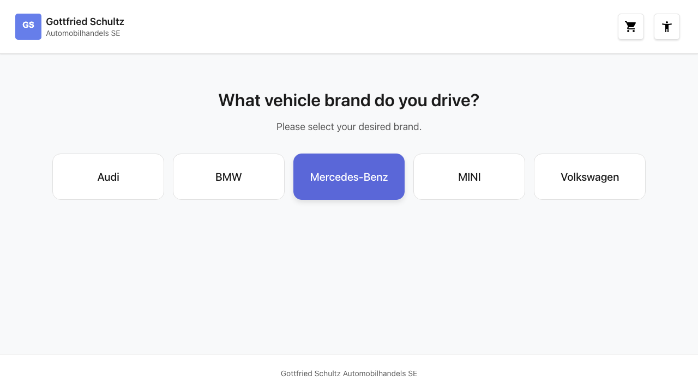
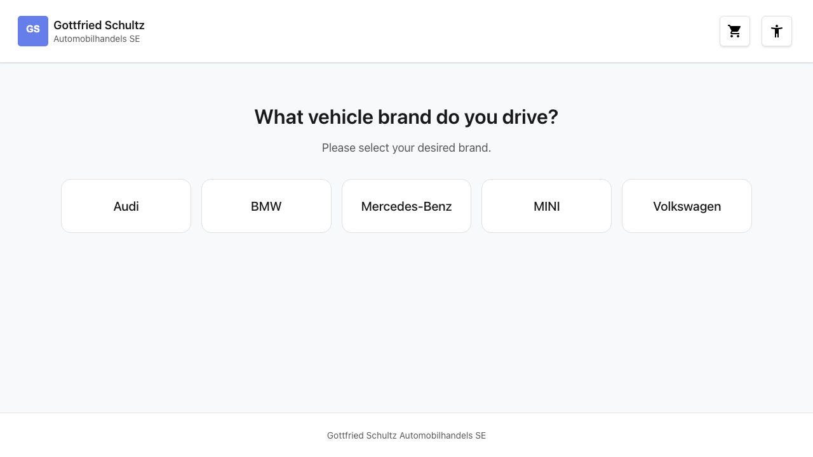
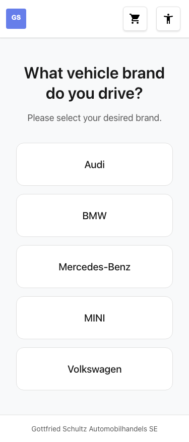

# Feature Documentation: Brand Selection

**Created:** 2026-02-14
**Requirement:** REQ-002-Markenauswahl
**Language:** EN
**Status:** Implemented

---

## Overview

Brand Selection is the first step in the booking wizard. The user selects their vehicle brand from five available brands (Audi, BMW, Mercedes-Benz, MINI, Volkswagen). After selection, the application automatically navigates to the next step (location selection).

---

## User Guide

### Step 1: View brand selection

**Description:** After the page loads, the user sees a heading ("What vehicle brand do you drive?") and a subtitle ("Please select your desired brand."). Below, five large buttons with the brand names are displayed.

- Desktop: 5 buttons side by side in one row
- Tablet: 3 + 2 buttons in two rows
- Mobile: 1 button per row (vertically stacked)

### Step 2: Select a brand

**Description:** The user clicks one of the brand buttons. The selected brand is saved to the BookingStore and the user is automatically redirected to the location selection (`/home/location`).

### Alternative: Change brand

**Description:** If the user navigates back to brand selection from a later step, the previously selected brand is visually highlighted (active button state). Selecting a different brand resets the location and services.

---

## Responsive Views

### Desktop (1280x720)

- 5 brand buttons in a single row (CSS Grid: `repeat(5, 1fr)`)
- Centered heading and subtitle
- Maximum width: 70em

### Tablet (768x1024)

- 3 buttons in the first row, 2 in the second (CSS Grid: `repeat(3, 1fr)`)
- Consistent spacing and font sizes

### Mobile (375x667)

- 1 button per row (CSS Grid: `1fr`)
- Full width for each button
- Touch-friendly: minimum height 2.75em (44px)

---

## Accessibility

- **Keyboard navigation:** All buttons are reachable via Tab and can be activated with Enter/Space
- **Screen reader:** Button group has `role="group"` with `aria-label="Vehicle brands"`. Active brand is communicated via `aria-pressed="true"`
- **Color contrast:** WCAG 2.1 AA compliant (CSS variables from the design system)
- **Focus styles:** Visible focus ring with `:focus-visible` (3px outline)
- **Reduced motion:** Transitions are disabled when `prefers-reduced-motion: reduce` is active

---

## Technical Details

| Property | Value |
|----------|-------|
| Route | `/#/home/brand` |
| Container Component | `BrandSelectionContainerComponent` |
| Presentational Component | `BrandButtonsComponent` |
| Store | `BookingStore` |
| API Service | `BookingApiService` |
| Resolver | `brandsResolver` |
| Data Source | Static (Click-Dummy) |

### Data Flow

1. User navigates to `/home/brand`
2. `brandsResolver` is triggered → calls `store.loadBrands()`
3. Store loads brands via `BookingApiService.getBrands()` (static data)
4. Container component displays title/subtitle (i18n) and passes `brands()` to `BrandButtonsComponent`
5. User clicks button → `brandSelected` event → `store.setBrand()` → navigation to `/home/location`

### Available Brands

| ID | Display Name |
|----|-------------|
| `audi` | Audi |
| `bmw` | BMW |
| `mercedes` | Mercedes-Benz |
| `mini` | MINI |
| `volkswagen` | Volkswagen |
