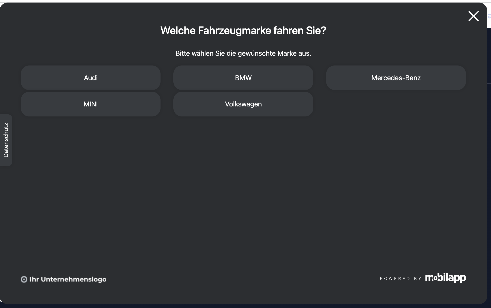

# REQ-002: Markenauswahl

**Status:** Implemented
**Priority:** High
**Type:** Functional
**Created:** 2026-02-13
**Author:** Claude Code
**Wizard-Schritt:** 1 von 8

---

## 1. Overview

### 1.1 Purpose
Einstiegsseite des Buchungsablaufs. Der Benutzer wählt seine Fahrzeugmarke aus 5 verfügbaren Marken. Dies ist der erste Schritt im Wizard und hat keine Vorbedingungen aus anderen Schritten.

### 1.2 Scope
**Included:**
- Anzeige von 5 Fahrzeugmarken als große, klickbare Buttons
- Speichern der gewählten Marke im BuchungStore
- Weiterleitung zu REQ-003-Standortwahl nach Auswahl

**Excluded:**
- Standortauswahl (→ REQ-003)
- Warenkorb-Dropdown (→ REQ-001 Header, zeigt nach Auswahl die gewählte Marke)

### 1.3 Related Requirements
- REQ-001: Header (Warenkorb-Icon zeigt nach Markenauswahl die gewählte Marke)
- REQ-003-Standortwahl (nächster Schritt)

---

## 2. User Story

**Als** Kunde
**möchte ich** meine Fahrzeugmarke auswählen
**damit** ich passende Standorte und Services für mein Fahrzeug sehe.

**Acceptance Criteria:**
- [ ] AC-1: Benutzer sieht 5 Marken-Buttons (Audi, BMW, Mercedes-Benz, MINI, Volkswagen)
- [ ] AC-2: Klick auf Marke speichert Auswahl im BuchungStore
- [ ] AC-3: Nach Klick wird zu `/home/standort` navigiert
- [ ] AC-4: Überschrift zeigt "Welche Fahrzeugmarke fahren Sie?"
- [ ] AC-5: Warenkorb-Icon im Header zeigt nach Auswahl die Marke im Dropdown

---

## 3. Preconditions

### 3.1 System#
- Angular App läuft
- Routing konfiguriert
- Header-Component verfügbar (REQ-001)
- BuchungStore verfügbar

### 3.2 User
- Keine Authentifizierung erforderlich
- Benutzer hat `/home` aufgerufen

### 3.3 Data
- Marken sind statisch konfiguriert (5 Stück) und über den resolver eingebaut.
- es in der store MXMehtode ein console.debug schreiben und eine stattischen wert zurückliefert
 
### 3.4 Übergabe (Input von vorheriger Seite)
| Feld | Quelle | Pflicht |
|------|--------|---------|
| — | — | **Keine Vorbedingung** (Einstiegsseite) |

---

## 4. Main Flow



**Step 1:** Seite wird geladen
- **System:** Zeigt Überschrift "Welche Fahrzeugmarke fahren Sie?" und 5 Marken-Buttons
- **System:** Buttons zeigen: Audi, BMW, Mercedes-Benz, MINI, Volkswagen
- **System:** Marken werden via Resolver aus statischen Daten geladen

**Step 2:** Benutzer wählt eine Marke
- **User:** Klickt auf einen Marken-Button
- **System:** Speichert `gewaehlteMarke` im BuchungStore
- **System:** Navigiert zu `/home/standort` (REQ-003)

---

## 5. Alternative Flows

### 5.1 Marke ändern (Zurück-Navigation)

**Trigger:** Benutzer navigiert von Schritt 2+ zurück zu Markenauswahl

**Flow:**
1. System zeigt Markenauswahl, vorherige Auswahl ist visuell hervorgehoben
2. Benutzer wählt andere Marke
3. System setzt `gewaehlterStandort` zurück (null), da Standorte markenabhängig
4. System setzt `gewaehlteServices` zurück (leer)
5. Navigation zu Standortwahl

---

## 6. Exception Flows

Keine — statische Daten, kein Fehlerfall möglich.

---

## 7. Postconditions

### 7.1 Success — Übergabe an REQ-003
| Feld | Typ | Wert | Beschreibung |
|------|-----|------|--------------|
| `BuchungStore.gewaehlteMarke` | `Marke` | z.B. `'audi'` | Gewählte Fahrzeugmarke |

### 7.2 Failure
- Keine Änderungen am Store (Benutzer hat nichts gewählt)

---

## 8. Business Rules

- **BR-1:** Genau 5 Marken verfügbar: Audi, BMW, Mercedes-Benz, MINI, Volkswagen
- **BR-2:** Nur eine Marke wählbar (kein Multi-Select)
- **BR-3:** Markenwechsel setzt Standort und Services zurück

---

## 9. Non-Functional Requirements

### Performance
- Seitenaufbau < 300ms (statische Daten)

### Usability
- Mobile-First: Buttons stacken vertikal auf Mobile
- Touch-friendly: Min 2.75em (44px) Button-Höhe
- WCAG 2.1 AA: Keyboard-Navigation mit Tab + Enter

---

## 10. Data Model

```typescript
type Marke = 'audi' | 'bmw' | 'mercedes' | 'mini' | 'volkswagen';

interface MarkeAnzeige {
  id: Marke;
  name: string; // "Audi", "BMW", etc.
}
```

**Statische Daten:**

| id | name |
|----|------|
| `audi` | Audi |
| `bmw` | BMW |
| `mercedes` | Mercedes-Benz |
| `mini` | MINI |
| `volkswagen` | Volkswagen |

---

## 11. UI/UX

### Mockup


### Layout
- Überschrift zentriert
- 5 große Buttons in Grid-Layout
- Desktop: 5 nebeneinander
- Tablet: 3 + 2
- Mobile: 1 Spalte

### Design-Hinweis
Screenshots zeigen dunkles Theme → Implementierung mit **hellem Theme** aus `_variables.scss`!

---

## 12. API Specification

```http
GET /api/marken
```

**Response (200):**
```json
[
  { "id": "audi", "name": "Audi" },
  { "id": "bmw", "name": "BMW" },
  { "id": "mercedes", "name": "Mercedes-Benz" },
  { "id": "mini", "name": "MINI" },
  { "id": "volkswagen", "name": "Volkswagen" }
]
```

> Click-Dummy: Statische Daten, kein echtes Backend.

---

## 13. Test Cases

### TC-1: Happy Path — Marke auswählen
- **Given:** Benutzer ist auf `/home/marke`
- **When:** Klickt auf "Audi"
- **Then:** `BuchungStore.gewaehlteMarke === 'audi'`, Navigation zu `/home/standort`

### TC-2: Keyboard-Navigation
- **Given:** Benutzer ist auf Markenauswahl
- **When:** Tab zu "BMW", Enter drücken
- **Then:** BMW wird gewählt, Navigation zu Standortwahl

### TC-3: Marke wechseln → Reset
- **Given:** Benutzer hat "Audi" gewählt, Standort "München" gewählt
- **When:** Navigiert zurück, wählt "BMW"
- **Then:** Standort wird zurückgesetzt (null), Services werden geleert

---

## 14. Implementation

### Components
- [ ] `MarkenauswahlContainerComponent` — Container, inject(BuchungStore)
- [ ] `MarkenButtonsComponent` — Presentational, `input(marken)`, `output(markeGewaehlt)`

### Route
```typescript
{
  path: 'marke',
  component: MarkenauswahlContainerComponent,
  resolve: { data: markenResolver }
}
```

### Folder
```
src/app/features/home/components/markenauswahl/
├── markenauswahl-container.component.ts
├── markenauswahl-container.component.html
├── markenauswahl-container.component.scss
└── marken-buttons.component.ts
    marken-buttons.component.html
    marken-buttons.component.scss
```

---

## 15. Dependencies

**Requires:**
- REQ-001: Header (Warenkorb-Icon)

**Blocks:**
- REQ-003-Standortwahl (benötigt `gewaehlteMarke`)

---

## 16. Naming Glossary

### Container Methods
| Methode | Beschreibung |
|---------|--------------|
| `beimMarkeWaehlen(marke)` | Marke ausgewählt → Store + Navigation |

### Signal Store Methods
| Methode | Beschreibung |
|---------|--------------|
| `setzeMarke(marke)` | Marke im BuchungStore setzen |
| `ladeMarken()` | Statische Marken laden |

### Computed Signals
| Signal | Beschreibung |
|--------|--------------|
| `marken` | Liste aller verfügbaren Marken |

---

## 17. i18n Keys

```typescript
// DE
buchung: {
  marke: {
    titel: 'Welche Fahrzeugmarke fahren Sie?',
    untertitel: 'Bitte wählen Sie die gewünschte Marke aus.'
  }
}

// EN
buchung: {
  marke: {
    titel: 'What vehicle brand do you drive?',
    untertitel: 'Please select your desired brand.'
  }
}
```

---

## 18. Approval

| Role | Name | Date |
|------|------|------|
| Product Owner | | |
| Tech Lead | | |
