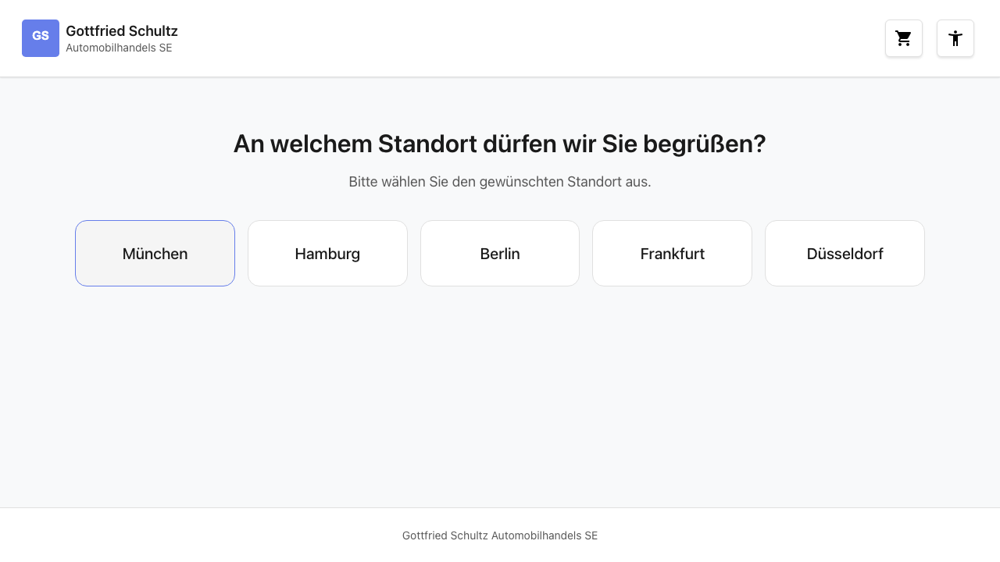
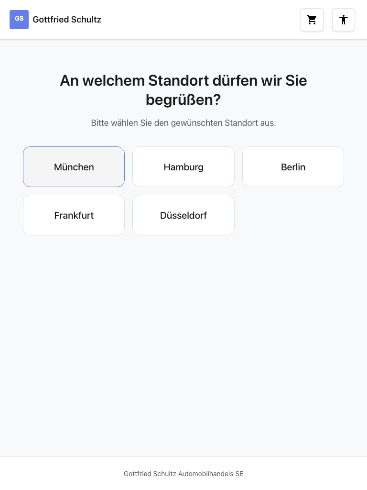
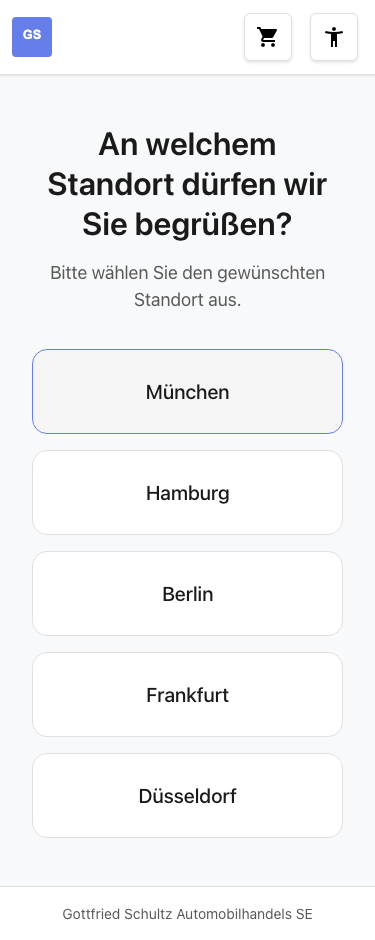

# Feature-Dokumentation: Standortwahl

**Erstellt:** 2026-02-17
**Requirement:** REQ-003-Standortwahl
**Sprache:** DE
**Status:** Implementiert

---

## Übersicht

Die Standortwahl ist der zweite Schritt im Buchungs-Wizard. Basierend auf der zuvor gewählten Fahrzeugmarke (REQ-002) werden dem Benutzer die verfügbaren Standorte (Autohäuser) als Buttons angezeigt. Die Standorte sind markenabhängig und werden über statische Daten gefiltert (Click-Dummy). Nach Auswahl eines Standorts wird automatisch zur Serviceauswahl (REQ-004) navigiert.

---

## Benutzerführung

### Schritt 1: Standorte anzeigen


**Beschreibung:** Nach dem Laden der Seite sieht der Benutzer eine Überschrift ("An welchem Standort dürfen wir Sie begrüßen?") sowie einen Untertitel ("Bitte wählen Sie den gewünschten Standort aus."). Darunter werden die markenspezifischen Standorte als Buttons angezeigt.

- Desktop: bis zu 5 Buttons nebeneinander in einer Reihe
- Tablet: 3 Buttons pro Reihe
- Mobile: 1 Button pro Reihe (vertikal gestapelt)

Die Anzahl der angezeigten Standorte variiert je nach Marke (3-5 Standorte).

### Schritt 2: Standort auswählen

**Beschreibung:** Der Benutzer klickt auf einen der Standort-Buttons. Der gewählte Standort wird im BookingStore gespeichert und der Benutzer wird automatisch zur Serviceauswahl (`/home/services`) weitergeleitet.

### Alternativ: Standort ändern

**Beschreibung:** Navigiert der Benutzer von einem späteren Schritt zurück zur Standortwahl, wird der zuvor gewählte Standort visuell hervorgehoben (aktiver Button-Zustand mit primärer Hintergrundfarbe). Bei Auswahl eines anderen Standorts werden die gewählten Services zurückgesetzt (BR-3).

### Alternativ: Zurück zur Markenauswahl

**Beschreibung:** Navigiert der Benutzer zur Markenauswahl zurück und wählt eine andere Marke, werden beim nächsten Aufruf der Standortwahl die Standorte der neuen Marke angezeigt.

---

## Responsive Ansichten

### Desktop (1280x720)


- Bis zu 5 Standort-Buttons in einer Reihe (CSS Grid: `repeat(5, 1fr)`)
- Zentrierte Überschrift und Untertitel
- Maximale Breite: 70em

### Tablet (768x1024)


- 3 Buttons pro Reihe (CSS Grid: `repeat(3, 1fr)`)
- Gleiche Abstände und Schriftgrößen wie Desktop

### Mobile (375x667)


- 1 Button pro Reihe (CSS Grid: `1fr`)
- Volle Breite für jeden Button
- Touch-freundlich: Mindesthöhe `var(--touch-target-min)` (2.75em / 44px)

---

## Barrierefreiheit

- **Tastaturnavigation:** Alle Buttons sind per Tab erreichbar und mit Enter/Space auslösbar
- **Screen Reader:** Button-Gruppe hat `role="group"` mit `aria-label="Standorte"` (DE) / `aria-label="Locations"` (EN). Aktiver Standort wird über `aria-pressed="true"` kommuniziert
- **Farbkontrast:** WCAG 2.1 AA konform (CSS-Variablen aus dem Design System)
- **Focus-Styles:** Sichtbarer Fokusring mit `:focus-visible` (3px Outline, `var(--color-focus-ring)`)
- **Reduced Motion:** Transitionen werden bei `prefers-reduced-motion: reduce` deaktiviert

---

## Technische Details

| Eigenschaft | Wert |
|-------------|------|
| Route | `/#/home/location` |
| Container Component | `LocationSelectionContainerComponent` |
| Presentational Component | `LocationButtonsComponent` |
| Store | `BookingStore` |
| API Service | `BookingApiService` |
| Resolver | `locationsResolver` |
| Guard | `brandSelectedGuard` |
| Datenquelle | Statisch (Click-Dummy) |

### Architektur

Die Standortwahl folgt dem Container/Presentational Pattern:

- **Container** (`LocationSelectionContainerComponent`): Injiziert den `BookingStore`, liest `filteredLocations` und `selectedLocation` als Signals, behandelt die Navigation nach Standort-Auswahl.
- **Presentational** (`LocationButtonsComponent`): Erhält Standorte via `input()`, emittiert Auswahl via `output()`. Keine Store-Abhängigkeit.

### Datenfluss

1. Benutzer navigiert zu `/home/location`
2. `brandSelectedGuard` prüft ob eine Marke im Store gewählt ist (redirect zu `/home/brand` wenn nicht)
3. `locationsResolver` wird ausgelöst und ruft `store.loadLocations()` auf
4. Store lädt Standorte über `BookingApiService.getLocations(brand)` (statische Daten, gefiltert nach Marke)
5. Container-Component zeigt Titel/Untertitel (i18n) und übergibt `locations()` sowie `selectedLocation()` an `LocationButtonsComponent`
6. Benutzer klickt Button -> `locationSelected` Event -> `store.setLocation()` -> Navigation zu `/home/services`

### Datenmodell

```typescript
// Location Display Model (vom API Service zurückgegeben)
interface LocationDisplay {
  id: string;
  name: string;
}

// Internes Location-Datenmodell (für Filterung)
interface LocationData {
  id: string;
  name: string;
  city: string;
  brands: Brand[];
}
```

### Standorte pro Marke

| Marke | Standorte |
|-------|-----------|
| Audi | München, Hamburg, Berlin, Frankfurt, Düsseldorf |
| BMW | Stuttgart, Köln, München, Berlin, Hamburg |
| Mercedes-Benz | Stuttgart, München, Frankfurt, Düsseldorf, Berlin |
| MINI | Garbsen, Hannover Südstadt, Steinhude |
| Volkswagen | Wolfsburg, Hannover, Berlin, München, Hamburg |

### Store-Integration (BookingStore)

| Element | Typ | Beschreibung |
|---------|-----|--------------|
| `locations` | State | Array aller geladenen Standorte |
| `selectedLocation` | State | Aktuell gewählter Standort (`LocationDisplay \| null`) |
| `filteredLocations` | Computed | Geladene Standorte (bereits marken-gefiltert) |
| `hasLocationSelected` | Computed | Boolean ob ein Standort gewählt ist |
| `loadLocations()` | rxMethod | Lädt Standorte via API (gefiltert nach `selectedBrand`) |
| `setLocation(location)` | Method | Setzt den gewählten Standort im State |

### Guard: brandSelectedGuard

Funktionaler `CanActivateFn` Guard. Prüft `store.hasBrandSelected()`. Bei `false` wird zu `/home/brand` umgeleitet. Stellt sicher, dass Schritt 2 nicht ohne Schritt 1 erreichbar ist.

### Resolver: locationsResolver

Funktionaler `ResolveFn<void>` Resolver. Ruft `store.loadLocations()` auf, bevor die Route aktiviert wird. Die Standorte werden basierend auf der im Store gespeicherten `selectedBrand` geladen.

---

## i18n Keys

| Key-Pfad | DE | EN |
|----------|----|----|
| `booking.location.title` | An welchem Standort dürfen wir Sie begrüßen? | At which location may we welcome you? |
| `booking.location.subtitle` | Bitte wählen Sie den gewünschten Standort aus. | Please select your desired location. |
| `booking.location.ariaGroupLabel` | Standorte | Locations |

**Zugriff im Template:**
```html
{{ booking.location.title | translate }}
{{ booking.location.subtitle | translate }}
```

**Zugriff im TypeScript:**
```typescript
protected readonly booking = i18nKeys.booking;
```

---

## Abhängigkeiten

### Benötigt

| Requirement | Beschreibung |
|-------------|--------------|
| REQ-001 (Header) | Warenkorb-Icon zeigt Marke + Standort nach Auswahl |
| REQ-002 (Markenauswahl) | Liefert `selectedBrand` im BookingStore |

### Blockiert

| Requirement | Beschreibung |
|-------------|--------------|
| REQ-004 (Serviceauswahl) | Benötigt `selectedLocation` im BookingStore |

---

## Dateistruktur

```
src/app/features/booking/
├── components/
│   └── location-selection/
│       ├── location-selection-container.component.ts
│       ├── location-selection-container.component.html
│       ├── location-selection-container.component.scss
│       ├── location-buttons.component.ts
│       ├── location-buttons.component.html
│       └── location-buttons.component.scss
├── guards/
│   └── brand-selected.guard.ts
├── models/
│   └── location.model.ts
├── resolvers/
│   └── locations.resolver.ts
├── services/
│   └── booking-api.service.ts
├── stores/
│   └── booking.store.ts
└── booking.routes.ts
```
