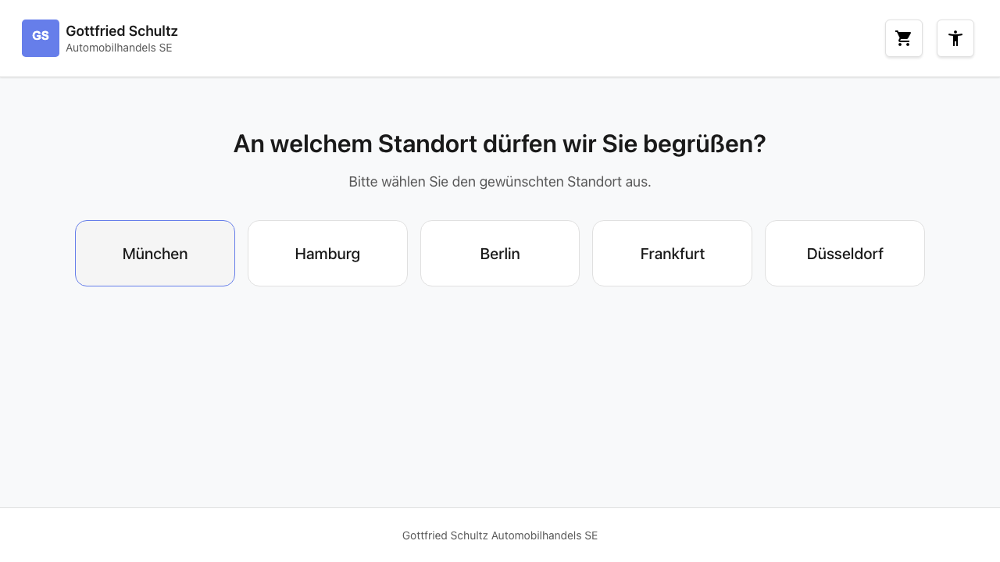
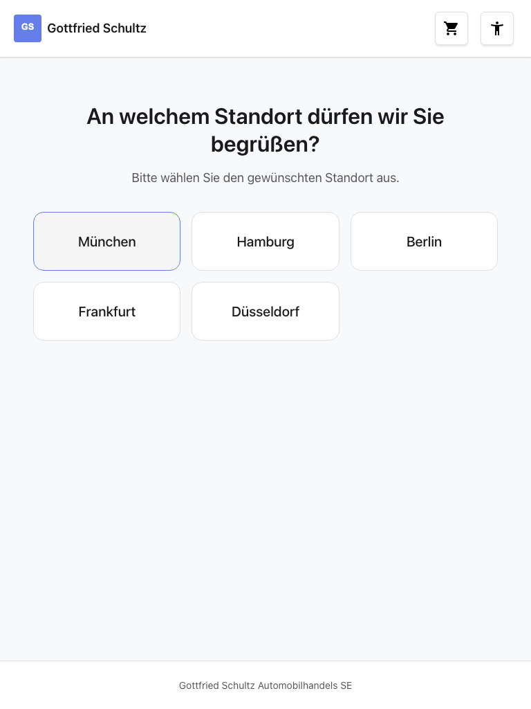
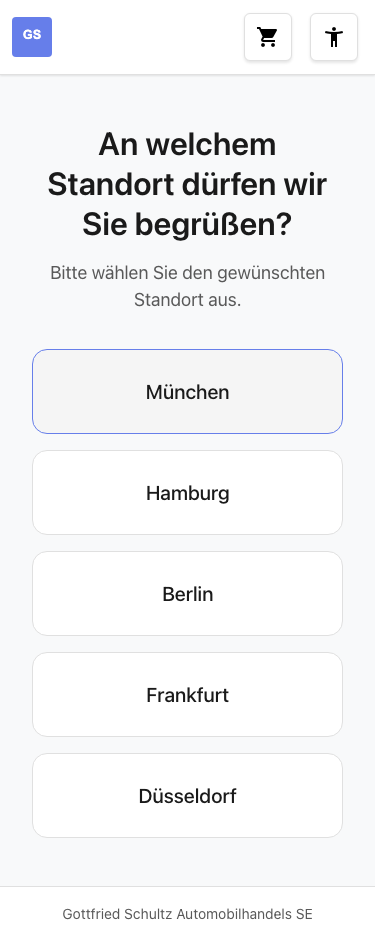

# Feature Documentation: Location Selection

**Created:** 2026-02-14
**Requirement:** REQ-003-Standortwahl
**Language:** EN
**Status:** Implemented

---

## Overview

Location Selection is the second step in the booking wizard. After the user has selected a vehicle brand in the previous step (REQ-002), the brand-specific locations (dealerships) are displayed here. The user selects a location, which is saved to the BookingStore. The application then automatically navigates to the next step (service selection, REQ-004).

---

## User Guide

### Step 1: View locations


**Description:** After loading the page `/home/location`, the system reads the previously selected brand from the BookingStore. Based on this brand, the matching locations are filtered and displayed as buttons. The user sees a heading ("At which location may we welcome you?") and a subtitle ("Please select your desired location."). Below, 3-5 location buttons are shown depending on the selected brand.

- Desktop: up to 5 buttons side by side in one row
- Tablet: 3 buttons in the first row, remaining in the second
- Mobile: 1 button per row (vertically stacked, full width)

### Step 2: Select a location

**Description:** The user clicks one of the location buttons. The selection is saved in the BookingStore under `selectedLocation` and the user is automatically redirected to the service selection (`/home/services`, REQ-004).

### Alternative: Back to brand selection

**Description:** The user can navigate back to the brand selection (`/home/brand`) via the back arrow. The previously selected brand remains in the store and is visually highlighted there.

### Alternative: Change location

**Description:** If the user navigates back to the location selection from a later step, the previously selected location is visually highlighted (active button state with `aria-pressed="true"`). When selecting a different location, any previously selected services are reset.

---

## Responsive Views

### Desktop (1280x720)


- Up to 5 location buttons in a single row (CSS Grid: `repeat(5, 1fr)`)
- Centered heading and subtitle
- Maximum width: 70em

### Tablet (768x1024)


- 3 buttons in the first row, remaining in the second (CSS Grid: `repeat(3, 1fr)`)
- Consistent spacing and font sizes matching desktop

### Mobile (375x667)


- 1 button per row (CSS Grid: `1fr`)
- Full width for each button
- Touch-friendly: minimum height `var(--touch-target-min)` (2.75em / 44px)

---

## Accessibility

- **Keyboard navigation:** All location buttons are reachable via Tab and can be activated with Enter/Space
- **Screen reader:** Button group has `role="group"` with translated `aria-label`. Active location is communicated via `aria-pressed="true"`
- **Color contrast:** WCAG 2.1 AA compliant (CSS variables from the design system, no hardcoded colors)
- **Focus styles:** Visible focus ring with `:focus-visible` (0.1875em outline using `--color-focus-ring`)
- **Reduced motion:** Transitions are disabled when `prefers-reduced-motion: reduce` is active (`transition: none`)

---

## Technical Details

| Property | Value |
|----------|-------|
| Route | `/#/home/location` |
| Container Component | `LocationSelectionContainerComponent` |
| Presentational Component | `LocationButtonsComponent` |
| Store | `BookingStore` |
| API Service | `BookingApiService` |
| Resolver | `locationsResolver` |
| Guard | `brandSelectedGuard` |
| Data Source | Static (Click-Dummy) |

### Data Flow

1. User navigates to `/home/location`
2. `brandSelectedGuard` checks if a brand is selected in the store. If not, the user is redirected to `/home/brand`
3. `locationsResolver` is triggered and calls `store.loadLocations()`
4. Store loads locations via `BookingApiService.getLocations(brand)` (static data, filtered by selected brand)
5. Container component displays title/subtitle (i18n) and passes `filteredLocations()` and `selectedLocation()` to `LocationButtonsComponent`
6. User clicks button -> `locationSelected` event -> `store.setLocation()` -> navigation to `/home/services`

### Locations per Brand

| Brand | Locations | Count |
|-------|-----------|-------|
| Audi | Munich, Hamburg, Berlin, Frankfurt, Duesseldorf | 5 |
| BMW | Stuttgart, Cologne, Munich, Berlin, Hamburg | 5 |
| Mercedes-Benz | Stuttgart, Munich, Frankfurt, Duesseldorf, Berlin | 5 |
| MINI | Garbsen, Hannover Suedstadt, Steinhude | 3 |
| Volkswagen | Wolfsburg, Hannover, Berlin, Munich, Hamburg | 5 |

### Data Model

```typescript
interface LocationDisplay {
  id: string;
  name: string;
  city: string;
}
```

### Folder Structure

```
src/app/features/booking/components/location-selection/
├── location-selection-container.component.ts
├── location-selection-container.component.html
├── location-selection-container.component.scss
├── location-selection-container.component.spec.ts
├── location-buttons.component.ts
├── location-buttons.component.html
├── location-buttons.component.scss
└── location-buttons.component.spec.ts
```
