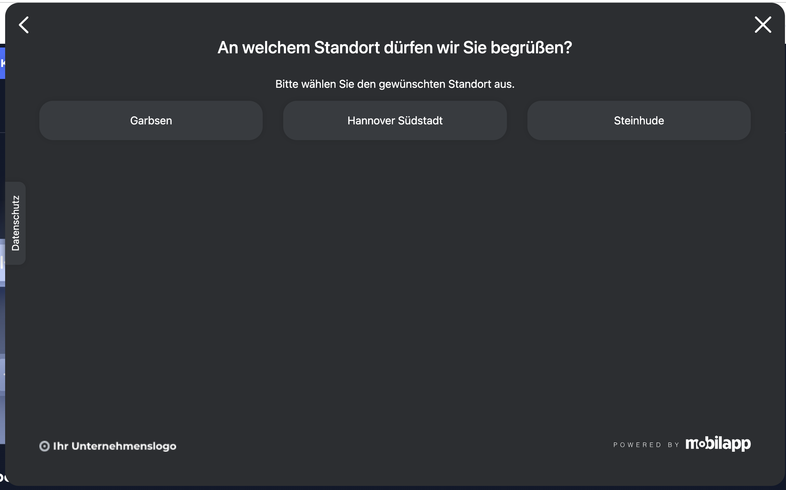

# REQ-003: Standortwahl

**Status:** Draft
**Priority:** High
**Type:** Functional
**Created:** 2026-02-13
**Author:** Claude Code
**Wizard-Schritt:** 2 von 8

---

## 1. Overview

### 1.1 Purpose
Der Benutzer wählt einen Standort (Autohaus) basierend auf der zuvor gewählten Fahrzeugmarke. Die verfügbaren Standorte sind markenabhängig.

### 1.2 Scope
**Included:**
- Anzeige markenspezifischer Standorte als Buttons
- Speichern des gewählten Standorts im BuchungStore
- Weiterleitung zu REQ-004-Serviceauswahl

**Excluded:**
- Markenauswahl (→ REQ-002)
- Serviceauswahl (→ REQ-004)

### 1.3 Related Requirements
- REQ-001: Header (Warenkorb zeigt nach Auswahl: Marke + Autohaus)
- REQ-002-Markenauswahl (vorheriger Schritt, liefert `gewaehlteMarke`)
- REQ-004-Serviceauswahl (nächster Schritt)

---

## 2. User Story

**Als** Kunde
**möchte ich** einen Standort in meiner Nähe auswählen
**damit** ich meinen Service-Termin dort wahrnehmen kann.

**Acceptance Criteria:**
- [ ] AC-1: Benutzer sieht nur Standorte der gewählten Marke
- [ ] AC-2: 3-5 Standorte werden als Buttons angezeigt
- [ ] AC-3: Klick speichert Standort im BuchungStore
- [ ] AC-4: Navigation zu `/home/services` nach Auswahl
- [ ] AC-5: Überschrift zeigt "An welchem Standort dürfen wir Sie begrüßen?"
- [ ] AC-6: Warenkorb-Icon im Header zeigt Marke + Autohaus im Dropdown

---

## 3. Preconditions

### 3.1 System
- BuchungStore verfügbar
- Header-Component (REQ-001) aktiv

### 3.2 User
- Benutzer hat `/home/standort` aufgerufen

### 3.3 Data
- Standorte pro Marke sind statisch konfiguriert und über den Resolver eingebaut.
- Store-Methode liefert ein console.log und einen statischen Wert zurück (Click-Dummy).

### 3.4 Übergabe (Input von REQ-002-Markenauswahl)
| Feld | Typ | Quelle | Pflicht |
|------|-----|--------|---------|
| `BuchungStore.gewaehlteMarke` | `Marke` | REQ-002 | **Ja** — Guard prüft, redirect zu `/home/marke` wenn leer |

---

## 4. Main Flow



**Step 1:** Seite wird geladen
- **System:** Liest `gewaehlteMarke` aus BuchungStore
- **System:** Filtert Standorte für diese Marke
- **System:** Zeigt Überschrift + Standort-Buttons

**Step 2:** Benutzer wählt einen Standort
- **User:** Klickt auf einen Standort-Button
- **System:** Speichert `gewaehlterStandort` im BuchungStore
- **System:** Navigiert zu `/home/services` (REQ-004)

---

## 5. Alternative Flows

### 5.1 Zurück zur Markenauswahl

**Trigger:** Benutzer klickt Zurück-Pfeil

**Flow:**
1. System navigiert zu `/home/marke`
2. Gewählte Marke bleibt im Store (visuell hervorgehoben)

### 5.2 Standort ändern

**Trigger:** Benutzer navigiert von Schritt 3+ zurück

**Flow:**
1. System zeigt Standorte, vorherige Auswahl hervorgehoben
2. Benutzer wählt anderen Standort
3. System setzt `gewaehlteServices` zurück (Standort hat sich geändert)

---

## 6. Exception Flows

### 6.1 Keine Marke gewählt

**Trigger:** Direktaufruf von `/home/standort` ohne Marke

**Flow:**
1. Guard prüft `BuchungStore.gewaehlteMarke`
2. Redirect zu `/home/marke`

---

## 7. Postconditions

### 7.1 Success — Übergabe an REQ-004
| Feld | Typ | Wert | Beschreibung |
|------|-----|------|--------------|
| `BuchungStore.gewaehlteMarke` | `Marke` | z.B. `'audi'` | Von REQ-002 (unverändert) |
| `BuchungStore.gewaehlterStandort` | `Standort` | z.B. `{ id: 'muc', name: 'München' }` | **Neu gewählt** |

### 7.2 Failure
- Keine Änderungen am Store

---

## 8. Business Rules

- **BR-1:** Standorte werden basierend auf `gewaehlteMarke` gefiltert
- **BR-2:** Nur ein Standort wählbar
- **BR-3:** Standortwechsel setzt Services zurück

---

## 9. Non-Functional Requirements

### Performance
- Seitenaufbau < 300ms (statische Daten, gefiltert)

### Usability
- Mobile-First: Buttons stacken vertikal
- Touch-friendly: Min 2.75em (44px)
- WCAG 2.1 AA

---

## 10. Data Model

```typescript
interface Standort {
  id: string;
  name: string;
  stadt: string;
  marken: Marke[];
}
```

**Standorte pro Marke:**

| Marke | Standorte |
|-------|-----------|
| Audi | München, Hamburg, Berlin, Frankfurt, Düsseldorf |
| BMW | Stuttgart, Köln, München, Berlin, Hamburg |
| Mercedes-Benz | Stuttgart, München, Frankfurt, Düsseldorf, Berlin |
| MINI | Garbsen, Hannover Südstadt, Steinhude |
| Volkswagen | Wolfsburg, Hannover, Berlin, München, Hamburg |

---

## 11. UI/UX

### Mockup


### Layout
- Überschrift zentriert
- Standort-Buttons in Grid
- Desktop: nebeneinander
- Mobile: 1 Spalte, full-width

### Design-Hinweis
Screenshots zeigen dunkles Theme → Implementierung mit **hellem Theme** aus `_variables.scss`!

---

## 12. API Specification

```http
GET /api/standorte/:markeId
```

**Response (200):**
```json
[
  { "id": "muc", "name": "München", "stadt": "München" },
  { "id": "ham", "name": "Hamburg", "stadt": "Hamburg" },
  { "id": "ber", "name": "Berlin", "stadt": "Berlin" }
]
```

> Click-Dummy: Statische Daten, gefiltert nach Marke.

---

## 13. Test Cases

### TC-1: Happy Path
- **Given:** Marke "Audi" gewählt
- **When:** Seite `/home/standort` wird geladen
- **Then:** 5 Standorte für Audi werden angezeigt

### TC-2: Standort auswählen
- **Given:** Standorte werden angezeigt
- **When:** Klick auf "München"
- **Then:** `BuchungStore.gewaehlterStandort.name === 'München'`, Navigation zu Services

### TC-3: Guard — keine Marke
- **Given:** Kein Marke im Store
- **When:** Direktaufruf `/home/standort`
- **Then:** Redirect zu `/home/marke`

### TC-4: Marke wechseln → Standorte ändern sich
- **Given:** Marke "Audi" (5 Standorte), wechselt zu "MINI"
- **When:** Standortseite lädt
- **Then:** Nur 3 MINI-Standorte sichtbar

---

## 14. Implementation

### Components
- [ ] `StandortauswahlContainerComponent` — Container, inject(BuchungStore)
- [ ] `StandortButtonsComponent` — Presentational, `input(standorte)`, `output(standortGewaehlt)`

### Route
```typescript
{
  path: 'standort',
  component: StandortauswahlContainerComponent,
  resolve: { data: standorteResolver },
  canActivate: [markeGewaehltGuard]
}
```

### Folder
```
src/app/features/home/components/standortauswahl/
├── standortauswahl-container.component.ts
├── standortauswahl-container.component.html
├── standortauswahl-container.component.scss
└── standort-buttons.component.ts
    standort-buttons.component.html
    standort-buttons.component.scss
```

---

## 15. Dependencies

**Requires:**
- REQ-001: Header (Warenkorb-Icon)
- REQ-002-Markenauswahl (liefert `gewaehlteMarke`)

**Blocks:**
- REQ-004-Serviceauswahl (benötigt `gewaehlterStandort`)

---

## 16. Naming Glossary

### Container Methods
| Methode | Beschreibung |
|---------|--------------|
| `beimStandortWaehlen(standort)` | Standort gewählt → Store + Navigation |

### Signal Store Methods
| Methode | Beschreibung |
|---------|--------------|
| `setzeStandort(standort)` | Standort im BuchungStore setzen |
| `ladeStandorte()` | Standorte laden (gefiltert nach Marke) |

### Computed Signals
| Signal | Beschreibung |
|--------|--------------|
| `gefilterteStandorte` | Standorte für gewählte Marke |

---

## 17. i18n Keys

```typescript
// DE
buchung: {
  standort: {
    titel: 'An welchem Standort dürfen wir Sie begrüßen?',
    untertitel: 'Bitte wählen Sie den gewünschten Standort aus.'
  }
}

// EN
buchung: {
  standort: {
    titel: 'At which location may we welcome you?',
    untertitel: 'Please select your desired location.'
  }
}
```

---

## 18. Approval

| Role | Name | Date |
|------|------|------|
| Product Owner | | |
| Tech Lead | | |
