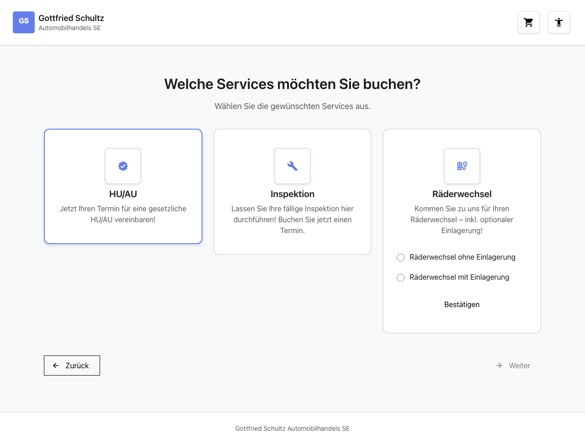
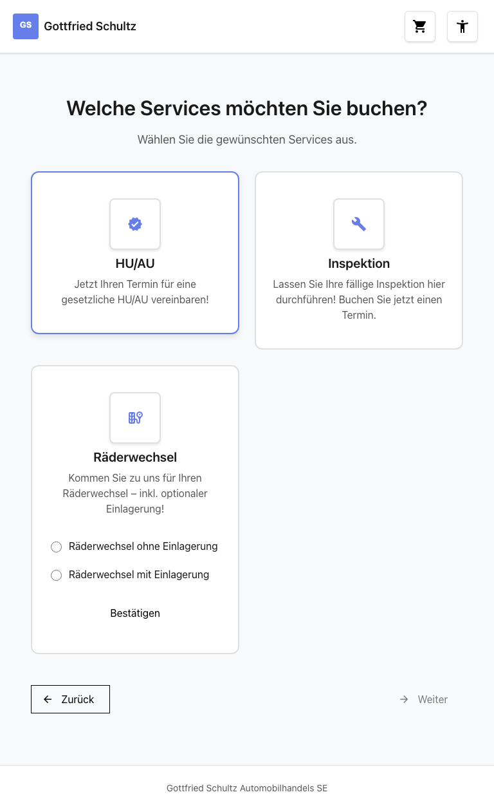
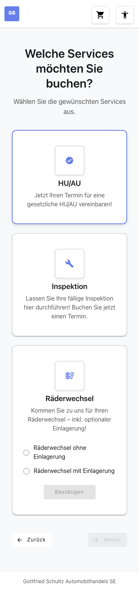

# Feature-Dokumentation: Serviceauswahl

**Erstellt:** 2026-02-18
**Requirement:** REQ-004-Serviceauswahl
**Sprache:** DE
**Status:** Implementiert

---

## Übersicht

Die Serviceauswahl ist der **3. Schritt im Buchungs-Wizard** (Marke -> Standort -> **Services** -> ...). Der Benutzer wählt einen oder mehrere Services für sein Fahrzeug aus drei verfügbaren Optionen: HU/AU, Inspektion und Räderwechsel. Die Auswahl erfolgt über interaktive Service-Karten in einem responsiven Grid-Layout. Für den Räderwechsel stehen zusätzlich Untervarianten (mit/ohne Einlagerung) zur Verfügung, die per Radio-Button direkt auf der Karte gewählt werden. Eine Zusammenfassungsleiste mit Zurück- und Weiter-Buttons ermöglicht die Navigation im Wizard.

---

## Benutzerführung

### Schritt 1: Seite laden

**Beschreibung:** Beim Aufruf der Route `/#/home/services` prüft ein Guard, ob eine Marke und ein Standort im BookingStore vorhanden sind. Ist dies der Fall, werden die drei Service-Karten (HU/AU, Inspektion, Räderwechsel) im Grid-Layout angezeigt. Über den Karten erscheint die Überschrift "Welche Services möchten Sie buchen?". Jede Karte zeigt einen Titel, ein zentriertes Icon mit Rahmen sowie einen Beschreibungstext. Unterhalb der Karten befindet sich eine Zeile mit den Buttons "zurück" (links) und "weiter" (rechts).

### Schritt 2: Service wählen (z.B. HU/AU)

**Beschreibung:** Der Benutzer klickt auf eine Service-Karte, z.B. "HU/AU". Die Karte wird als selektiert markiert: Ein Häkchen-Icon erscheint oben rechts auf der Karte und die Karte erhält eine farbliche Umrandung. Im Header-Warenkorb wird der gewählte Service als Chip mit Icon angezeigt und ein Anzahl-Badge erscheint.

### Schritt 3: Weiteren Service wählen (Multi-Select)

**Beschreibung:** Der Benutzer kann weitere Service-Karten anklicken, z.B. "Inspektion". Mehrere Services können gleichzeitig ausgewählt sein (Multi-Select). Jede selektierte Karte zeigt ein Häkchen und eine Umrandung. Der Header-Warenkorb aktualisiert automatisch die Anzahl und zeigt alle gewählten Services als Chips an. Durch erneutes Klicken auf eine bereits selektierte Karte wird der Service wieder abgewählt.

### Schritt 4: Räderwechsel mit Variante wählen

**Beschreibung:** Die Räderwechsel-Karte unterscheidet sich von den anderen Karten: Sie enthält zusätzlich zwei Radio-Buttons ("Räderwechsel ohne Einlagerung" und "Räderwechsel mit Einlagerung") sowie einen "Bestätigen"-Button direkt auf der Karte. Der Benutzer wählt zunächst eine Variante per Radio-Button und klickt dann auf "Bestätigen". Die Karte wird daraufhin als selektiert markiert und der Button-Text wechselt zu "Abwählen". Über den "Abwählen"-Button kann der Service wieder deselektiert werden.

### Schritt 5: Weiter klicken

**Beschreibung:** Nachdem mindestens ein Service gewählt wurde, klickt der Benutzer auf den "weiter"-Button unterhalb der Service-Karten (rechts in der Button-Zeile). Das System speichert die gewählten Services mit ihren Varianten im BookingStore und navigiert zum nächsten Wizard-Schritt. Ist kein Service gewählt, bleibt der "weiter"-Button deaktiviert. Über den "zurück"-Button (links) kann der Benutzer zur Standortwahl zurückkehren.

---

## Responsive Ansichten

### Desktop (1280x720)

Alle drei Service-Karten werden nebeneinander in einer Zeile dargestellt. Die Zusammenfassungsleiste zeigt die Chips inline neben dem Warenkorb-Icon.

### Tablet (768x1024)

Die Service-Karten werden in einem 2-Spalten-Grid angeordnet. Die dritte Karte rutscht in eine eigene Zeile.

### Mobile (375x667)

Die Service-Karten stacken vertikal untereinander (1 Spalte). Die Zusammenfassungsleiste erstreckt sich über die gesamte Breite.

---

## Barrierefreiheit

- **Tastaturnavigation:** Service-Karten sind per Tab-Taste erreichbar und können mit Enter oder Space selektiert/deselektiert werden. Die Radio-Buttons der Räderwechsel-Karte sind per Tab erreichbar und mit den Pfeiltasten navigierbar.
- **Screen Reader:** Die Service-Karten verwenden `role="group"` und `aria-pressed` zur Kennzeichnung des Auswahlstatus. Jede Karte hat ein `aria-label` mit dem Service-Namen. Radio-Buttons sind in einer `mat-radio-group` mit entsprechendem Label gruppiert.
- **Farbkontrast:** WCAG 2.1 AA konform mit mindestens 4.5:1 Kontrastverhältnis fuer Text und interaktive Elemente.
- **Focus-Styles:** Sichtbare Fokus-Indikatoren (`:focus-visible`) auf allen interaktiven Elementen. Touch-Targets haben eine Mindestgroesse von 2.75em (44px).

---

## Technische Details

| Eigenschaft | Wert |
|-------------|------|
| Route | `/#/home/services` |
| Container Component | `ServiceSelectionContainerComponent` |
| Store | `BookingStore` |
| API Service | `BookingApiService` |
| Guard | `locationSelectedGuard` |
| Resolver | `servicesResolver` |
| Presentational Components | `ServiceCardComponent`, `ServiceSummaryBarComponent` |
