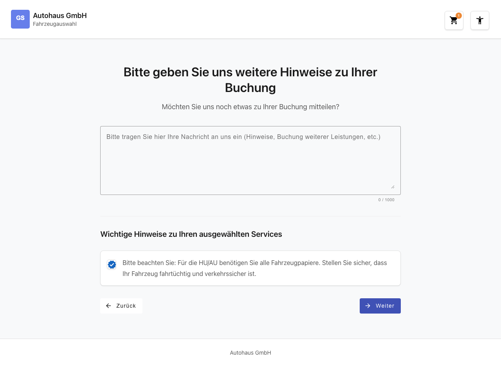
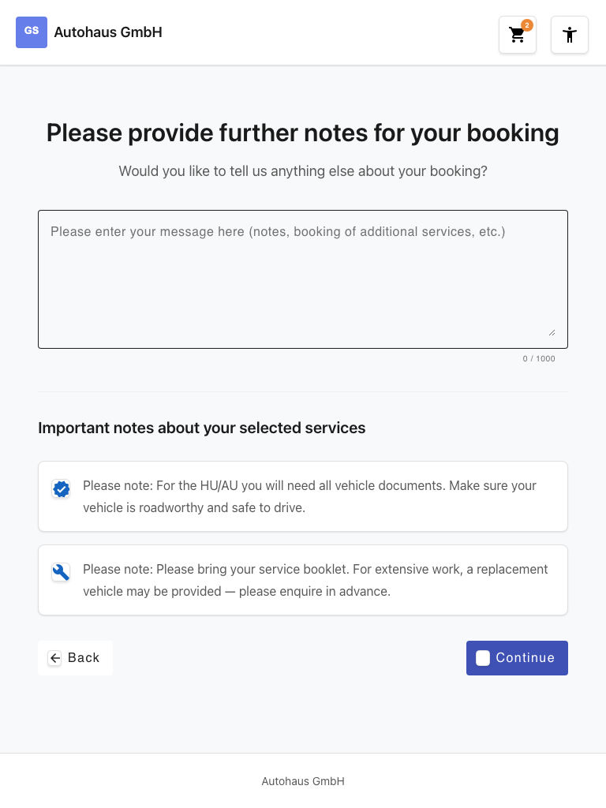
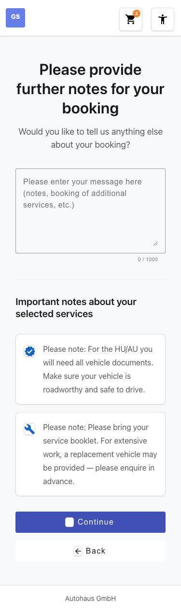

# Feature Documentation: Booking Notes

**Created:** 2026-02-23
**Requirement:** REQ-005-Hinweisfenster
**Language:** EN
**Status:** Implemented

---

## Overview

The booking notes page is **step 4 in the booking wizard** (Brand -> Location -> Services -> **Notes** -> ...). After the service selection (REQ-004), the user can enter optional notes for their booking. The page displays a free-text field (max. 1000 characters) with a real-time character counter as well as service-specific hints that are shown only for the previously selected services. The entered booking note is saved in the BookingStore and passed to the next wizard step.

---

## User Guide

### Step 1: Page Load

**Description:** When navigating to the route `/#/home/notes`, the `servicesSelectedGuard` checks whether a brand, a location, and at least one service are present in the BookingStore. If so, the page is displayed with the heading "Please provide further notes for your booking" and the subheading "Would you like to tell us anything else about your booking?". A free-text field with placeholder text and the character counter "0 / 1000" is rendered. Below, the section "Important notes about your selected services" appears with service-specific hint texts that are only visible for the actually selected services. Back and Continue buttons are positioned at the bottom of the page.

### Step 2: Focus the Text Field

**Description:** The user clicks on the free-text field. The placeholder text "Please enter your message here (notes, booking of additional services, etc.)" disappears (standard HTML behavior). The cursor is visible in the text field and the user can begin typing.

### Step 3: Enter a Message

**Description:** The user types their text into the free-text field. The character counter updates in real time with each keystroke (e.g. "87 / 1000"). The maximum character count of 1000 is enforced by `maxlength` and Reactive Forms validation. When the limit is reached, no further characters are accepted.

### Step 4: Click Continue

**Description:** The user clicks the "Continue" button. The system saves the entered text as `bookingNote` in the BookingStore and navigates to the next wizard step. The text field is optional: the Continue button is always active, even without text input. In that case, `bookingNote: null` is saved. Via the "Back" button, the user can return to the service selection (`/home/services`).

---

## Responsive Views

### Desktop (1280x720)

The free-text field spans the full width of the content area with 6 rows of height. The service-specific hints are displayed stacked vertically. The "Back" and "Continue" buttons are positioned side by side (Back on the left, Continue on the right).

### Tablet (768x1024)

The layout largely matches the desktop view: full-width text field, stacked hints, buttons side by side.

### Mobile (375x667)

The text field takes up the full screen width. The hint texts stack vertically. The buttons are stacked vertically (Back on top, Continue below) and each span the full width.

---

## Accessibility

- **Keyboard Navigation:** The tab order follows the logical page structure: text field, Back button, Continue button. All interactive elements are reachable via the Tab key and operable with Enter or Space.
- **Screen Reader:** The text field is equipped with an `aria-label` and `aria-describedby` (referencing the character counter). The character counter is marked as an `aria-live="polite"` region so that changes are automatically announced. Hint items use `role="note"`.
- **Color Contrast:** WCAG 2.1 AA compliant with a minimum contrast ratio of 4.5:1 for text and interactive elements.
- **Focus Styles:** Visible focus indicators (`:focus-visible`) on all interactive elements. Touch targets have a minimum size of 2.75em (44px).

---

## Technical Details

| Property | Value |
|----------|-------|
| Route | `/#/home/notes` |
| Container Component | `NotesContainerComponent` |
| Store | `BookingStore` (extended with `bookingNote`) |
| Guard | `servicesSelectedGuard` |
| Presentational Components | `NotesFormComponent`, `ServiceHintsComponent` |
| Store Method | `setBookingNote(note: string \| null)` |
| Computed Signal | `hasBookingNote` |
| Form | Reactive Forms (`FormControl<string>`, `Validators.maxLength(1000)`) |
| i18n Keys | `booking.notes.*` (DE + EN) |
