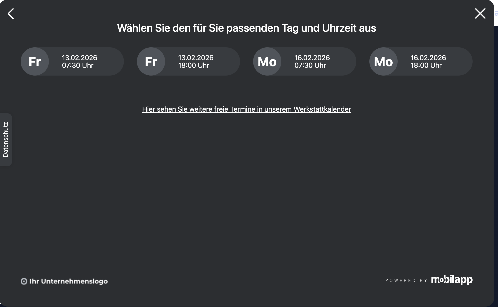
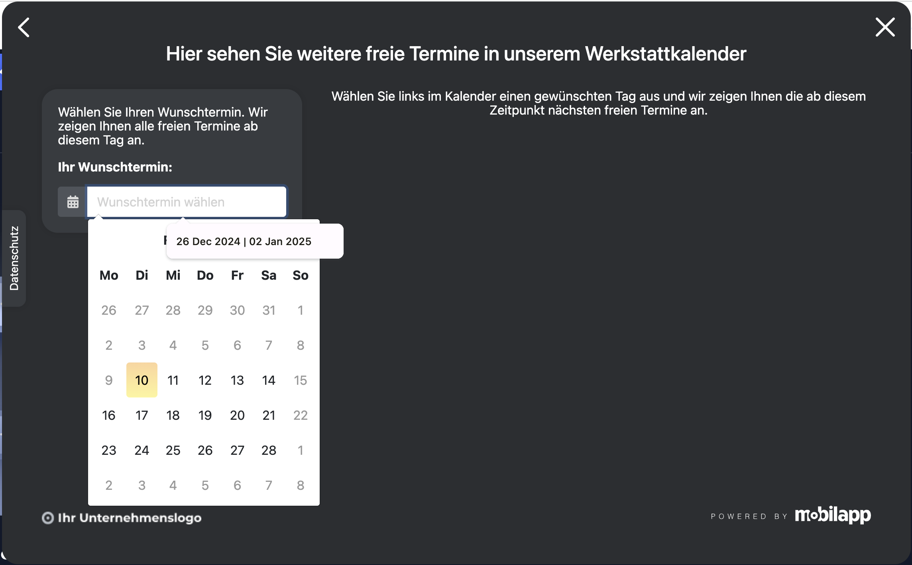

# REQ-005: Terminauswahl

**Status:** Draft
**Priority:** High
**Type:** Functional
**Created:** 2026-02-13
**Author:** Claude Code
**Wizard-Schritt:** 4+5 von 8

---

## 1. Overview

### 1.1 Purpose
Der Benutzer wählt einen Termin: entweder über Schnellauswahl (4 dynamisch berechnete Vorschläge) oder über den Werkstattkalender (Datepicker + Uhrzeiten-Grid). Beide Ansichten sind Teil dieser Route.

### 1.2 Scope
**Included:**
- Schnelltermin-Vorschläge (4 Termine, dynamisch berechnet)
- Werkstattkalender mit Datepicker + Uhrzeiten-Grid
- Dynamische Berechnung des nächsten Arbeitstags
- Speichern des Termins im BuchungStore

**Excluded:**
- Serviceauswahl (→ REQ-004)
- Kundendaten (→ REQ-006)

### 1.3 Related Requirements
- REQ-001: Header (Warenkorb zeigt Marke + Autohaus + Services + Termin)
- REQ-004-Serviceauswahl (vorheriger Schritt)
- REQ-006-Kundendaten (nächster Schritt)

---

## 2. User Story

**Als** Kunde
**möchte ich** einen passenden Werkstatttermin auswählen
**damit** ich mein Fahrzeug zum gewünschten Zeitpunkt bringen kann.

**Acceptance Criteria:**
- [ ] AC-1: 4 Schnelltermine werden dynamisch berechnet (nächste Arbeitstage)
- [ ] AC-2: Klick auf Schnelltermin speichert und navigiert weiter
- [ ] AC-3: "Werkstattkalender"-Link öffnet Kalender-Ansicht
- [ ] AC-4: Kalender zeigt nur Arbeitstage (Mo-Fr), Wochenenden ausgegraut
- [ ] AC-5: Uhrzeiten-Grid zeigt verfügbare Zeiten für 3 Arbeitstage
- [ ] AC-6: Warenkorb-Icon im Header zeigt nach Auswahl auch den Termin

---

## 3. Preconditions

### 3.1 System
- BuchungStore verfügbar
- Header-Component (REQ-001) aktiv

### 3.2 User
- Benutzer hat `/home/termin` aufgerufen

### 3.3 Data
- Schnelltermine werden dynamisch berechnet (clientseitig), über den Resolver eingebaut.
- Kalender-Termine sind statisch konfiguriert und über den Resolver eingebaut.
- Store-Methode liefert ein console.log und einen statischen Wert zurück (Click-Dummy).

### 3.4 Übergabe (Input von REQ-004-Serviceauswahl)
| Feld | Typ | Quelle | Pflicht |
|------|-----|--------|---------|
| `BuchungStore.gewaehlteMarke` | `Marke` | REQ-002 | **Ja** |
| `BuchungStore.gewaehlterStandort` | `Standort` | REQ-003 | **Ja** |
| `BuchungStore.gewaehlteServices` | `GewaehlterService[]` | REQ-004 | **Ja** (min 1) — Guard prüft, redirect zu `/home/services` wenn leer |

---

## 4. Main Flow

### 4a: Schnelltermin-Auswahl



**Step 1:** Seite wird geladen
- **System:** Berechnet 4 Schnelltermine ab nächstem Arbeitstag
- **System:** Zeigt "Wählen Sie den für Sie passenden Tag und Uhrzeit aus"
- **System:** Zeigt 4 Termin-Karten + "Werkstattkalender"-Link

**Step 2:** Benutzer wählt Schnelltermin
- **User:** Klickt auf Termin-Karte
- **System:** Speichert `gewaehlterTermin` im BuchungStore
- **System:** Navigiert zu `/home/kundendaten` (REQ-006)

### 4b: Kalender-Auswahl




**Step 1:** Benutzer klickt "Werkstattkalender"
- **System:** Zeigt Datepicker + Uhrzeiten-Grid

**Step 2:** Benutzer wählt Datum
- **User:** Klickt auf Datum im Kalender (nur Arbeitstage wählbar)
- **System:** Lädt verfügbare Uhrzeiten für 3 Arbeitstage ab diesem Datum

**Step 3:** Benutzer wählt Uhrzeit
- **User:** Klickt auf Uhrzeit-Button
- **System:** Speichert `gewaehlterTermin` im BuchungStore
- **System:** Navigiert zu `/home/kundendaten` (REQ-006)

### Dynamische Berechnung

```
Nächster Arbeitstag ab heute (Mo-Fr):
- Mo-Do → nächster Tag
- Fr nach 18:00 → Montag
- Sa/So → Montag

Schnelltermine: 2 Tage × 2 Uhrzeiten = 4 Termine
- Tag 1: 07:30 + 18:00
- Tag 2: 07:30 + 18:00
```

**Beispiel (heute = Do 12.02.2026):**

| # | Wochentag | Datum | Uhrzeit |
|---|-----------|-------|---------|
| 1 | Fr | 13.02.2026 | 07:30 |
| 2 | Fr | 13.02.2026 | 18:00 |
| 3 | Mo | 16.02.2026 | 07:30 |
| 4 | Mo | 16.02.2026 | 18:00 |

**Verfügbare Uhrzeiten (Kalender):**
- 07:30, 09:00, 09:10, 09:20, 09:30, 09:40, 09:50, 10:00
- 14:00, 16:00, 16:30, 17:00, 17:30, 18:00

---

## 5. Alternative Flows

### 5.1 Zurück zur Serviceauswahl

**Trigger:** Benutzer klickt Zurück-Pfeil

**Flow:**
1. Navigation zu `/home/services`
2. Gewählte Services bleiben erhalten

### 5.2 Kalender statt Schnellauswahl

**Trigger:** Benutzer klickt "Werkstattkalender"-Link

**Flow:**
1. Schnelltermin-Ansicht wechselt zu Kalender-Ansicht
2. Datepicker + Uhrzeiten-Grid werden angezeigt
3. Benutzer wählt Datum → Uhrzeiten laden
4. Benutzer wählt Uhrzeit → Termin gespeichert

---

## 6. Exception Flows

### 6.1 Keine Services gewählt

**Trigger:** Direktaufruf ohne Services

**Flow:**
1. Guard prüft `BuchungStore.gewaehlteServices`
2. Redirect zu `/home/services`

---

## 7. Postconditions

### 7.1 Success — Übergabe an REQ-006
| Feld | Typ | Wert | Beschreibung |
|------|-----|------|--------------|
| `BuchungStore.gewaehlteMarke` | `Marke` | | Von REQ-002 |
| `BuchungStore.gewaehlterStandort` | `Standort` | | Von REQ-003 |
| `BuchungStore.gewaehlteServices` | `GewaehlterService[]` | Min 1 | Von REQ-004 |
| `BuchungStore.gewaehlterTermin` | `Termin` | z.B. `{ datum: '2026-02-13', uhrzeit: '07:30' }` | **Neu gewählt** |

### 7.2 Failure
- Keine Änderungen am Store

---

## 8. Business Rules

- **BR-1:** Nur Arbeitstage (Mo-Fr) für Termine verfügbar
- **BR-2:** Schnelltermine werden dynamisch ab nächstem Arbeitstag berechnet
- **BR-3:** Kalender zeigt nur Arbeitstage, Wochenenden sind ausgegraut
- **BR-4:** 2 Uhrzeiten pro Tag bei Schnellwahl: 07:30 (Früh) und 18:00 (Spät)
- **BR-5:** Kalender zeigt Uhrzeiten für 3 Arbeitstage ab gewähltem Datum

---

## 9. Non-Functional Requirements

### Performance
- Schnelltermin-Berechnung < 50ms (clientseitig)
- Kalender-Uhrzeiten laden < 300ms

### Usability
- Touch-friendly: Min 2.75em Termin-Karten
- WCAG 2.1 AA: Datepicker per Keyboard bedienbar

---

## 10. Data Model

```typescript
interface Termin {
  id: string;
  datum: Date;
  uhrzeit: string; // "07:30", "09:00", etc.
  verfuegbar: boolean;
}

interface SchnellTermin {
  id: string;
  datum: Date;
  uhrzeit: string;
  wochentag: string; // "Fr", "Mo", etc.
}

interface KalenderTag {
  datum: string;
  wochentag: string;
  uhrzeiten: string[];
}
```

---

## 11. UI/UX

### Mockups
| Ansicht | Screenshot |
|---------|------------|
| Schnelltermine |  |
| Kalender |  |
| Uhrzeiten |  |

### Layout
- Schnelltermine: 4 Karten in 2x2 Grid (Desktop), 1 Spalte (Mobile)
- Kalender: Datepicker links, Uhrzeiten-Grid rechts (Desktop), gestapelt (Mobile)

---

## 12. API Specification

```http
GET /api/termine/schnell/:standortId
```

**Response (200):**
```json
[
  { "id": "t1", "datum": "2026-02-13", "uhrzeit": "07:30", "wochentag": "Fr" },
  { "id": "t2", "datum": "2026-02-13", "uhrzeit": "18:00", "wochentag": "Fr" },
  { "id": "t3", "datum": "2026-02-16", "uhrzeit": "07:30", "wochentag": "Mo" },
  { "id": "t4", "datum": "2026-02-16", "uhrzeit": "18:00", "wochentag": "Mo" }
]
```

```http
GET /api/termine/kalender/:standortId/:datum
```

**Response (200):**
```json
{
  "tage": [
    { "datum": "2026-02-16", "wochentag": "Mo", "uhrzeiten": ["07:30", "09:00", "14:00", "18:00"] },
    { "datum": "2026-02-17", "wochentag": "Di", "uhrzeiten": ["07:30", "09:00", "14:00", "18:00"] },
    { "datum": "2026-02-18", "wochentag": "Mi", "uhrzeiten": ["07:30", "09:00", "14:00", "18:00"] }
  ]
}
```

---

## 13. Test Cases

### TC-1: Schnelltermine dynamisch berechnet
- **Given:** Heute ist Do 12.02.2026
- **When:** Terminauswahl öffnet
- **Then:** Erste Termine: Fr 13.02 (07:30, 18:00), Mo 16.02 (07:30, 18:00)

### TC-2: Wochenende → Montag
- **Given:** Heute ist Sa 14.02.2026
- **When:** Terminauswahl öffnet
- **Then:** Erste Termine: Mo 16.02 (07:30, 18:00)

### TC-3: Kalender öffnen
- **Given:** Schnelltermine werden angezeigt
- **When:** Klick auf "Werkstattkalender"
- **Then:** Datepicker + Uhrzeiten-Grid sichtbar

### TC-4: Wochenende im Kalender ausgegraut
- **Given:** Kalender ist offen
- **Then:** Sa/So sind nicht wählbar

### TC-5: Guard — keine Services
- **Given:** Keine Services im Store
- **When:** Direktaufruf `/home/termin`
- **Then:** Redirect zu `/home/services`

---

## 14. Implementation

### Components
- [ ] `TerminauswahlContainerComponent` — Container, Schnell + Kalender
- [ ] `SchnellTermineComponent` — Presentational, 4 Termin-Karten
- [ ] `KalenderComponent` — Presentational, Datepicker
- [ ] `UhrzeitenGridComponent` — Presentational, Uhrzeiten-Buttons

### Route
```typescript
{
  path: 'termin',
  component: TerminauswahlContainerComponent,
  resolve: { data: termineResolver },
  canActivate: [servicesGewaehltGuard]
}
```

### Folder
```
src/app/features/home/components/terminauswahl/
├── terminauswahl-container.component.ts
├── terminauswahl-container.component.html
├── terminauswahl-container.component.scss
├── schnell-termine.component.ts / .html / .scss
├── kalender.component.ts / .html / .scss
└── uhrzeiten-grid.component.ts / .html / .scss
```

---

## 15. Dependencies

**Requires:**
- REQ-001: Header (Warenkorb-Icon)
- REQ-004-Serviceauswahl (liefert `gewaehlteServices`)

**Blocks:**
- REQ-006-Kundendaten (benötigt `gewaehlterTermin`)

---

## 16. Naming Glossary

### Container Methods
| Methode | Beschreibung |
|---------|--------------|
| `beimTerminWaehlen(termin)` | Schnelltermin gewählt |
| `beimKalenderOeffnen()` | Kalender-Link geklickt |
| `beimDatumWaehlen(datum)` | Datum im Kalender gewählt |
| `beimUhrzeitWaehlen(uhrzeit)` | Uhrzeit gewählt |

### Signal Store Methods
| Methode | Beschreibung |
|---------|--------------|
| `setzeTermin(termin)` | Termin im Store setzen |
| `ladeSchnellTermine()` | Schnelltermine berechnen |
| `ladeKalenderTermine(datum)` | Kalender-Uhrzeiten laden |

### Computed Signals
| Signal | Beschreibung |
|--------|--------------|
| `schnellTermineDynamisch` | 4 dynamisch berechnete Termine |
| `naechsterArbeitstag` | Nächster Mo-Fr ab heute |

---

## 17. i18n Keys

```typescript
// DE
buchung: {
  termin: {
    titel: 'Wählen Sie den für Sie passenden Tag und Uhrzeit aus',
    kalenderLink: 'Hier sehen Sie weitere freie Termine in unserem Werkstattkalender'
  },
  kalender: {
    titel: 'Hier sehen Sie weitere freie Termine in unserem Werkstattkalender',
    wunschtermin: 'Ihr Wunschtermin:',
    wunschterminHilfe: 'Wählen Sie Ihren Wunschtermin. Wir zeigen Ihnen alle freien Termine ab diesem Tag an.',
    verfuegbar: 'Wählen Sie links im Kalender einen gewünschten Tag aus...'
  }
}

// EN
buchung: {
  termin: {
    titel: 'Select the day and time that suits you',
    kalenderLink: 'See more available appointments in our workshop calendar'
  },
  kalender: {
    titel: 'See more available appointments in our workshop calendar',
    wunschtermin: 'Your preferred date:',
    wunschterminHilfe: 'Select your preferred date. We will show you all available appointments.',
    verfuegbar: 'Select a date in the calendar on the left...'
  }
}
```

---

## 18. Approval

| Role | Name | Date |
|------|------|------|
| Product Owner | | |
| Tech Lead | | |
