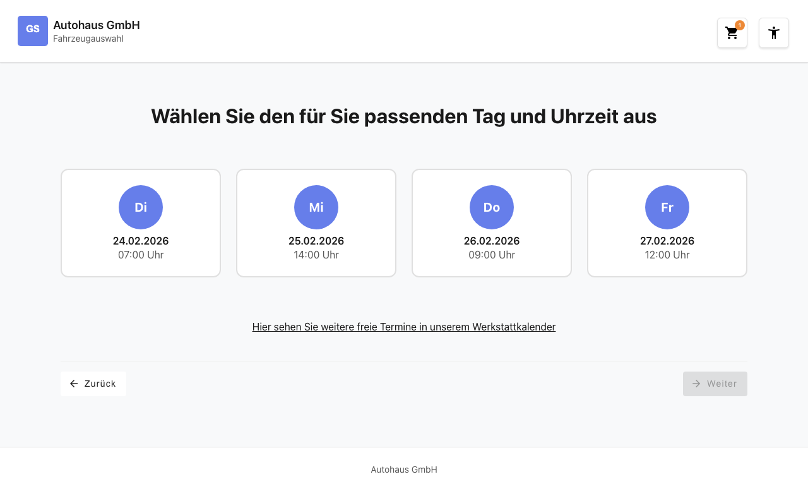
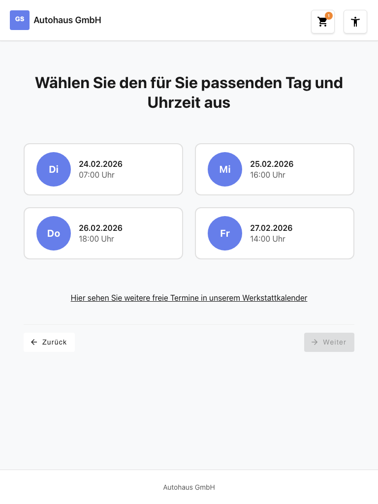
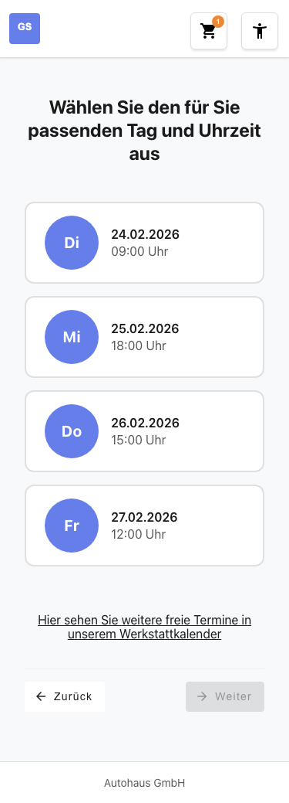

# Feature-Dokumentation: Terminauswahl

**Erstellt:** 2026-02-23
**Requirement:** REQ-006-Terminauswahl
**Sprache:** DE
**Status:** Implementiert

---

## Übersicht

Die Terminauswahl ist der fünfte Schritt im Buchungswizard. Der Benutzer wählt aus vier automatisch generierten Terminvorschlägen den für ihn passenden Tag und die passende Uhrzeit aus. Alle Termine liegen in der Zukunft (ab morgen), fallen auf Werktage (Montag bis Samstag, kein Sonntag) und bieten Uhrzeiten zwischen 07:00 und 18:00 Uhr an.

Das Feature folgt dem Container/Presentational Pattern: Der `AppointmentSelectionContainerComponent` verwaltet die Daten über den `BookingStore`, während der `AppointmentCardComponent` die einzelnen Termin-Cards als reine Darstellungskomponente rendert.

---

## Benutzerführung

### Schritt 1: Seite aufrufen

**Beschreibung:** Der Benutzer gelangt nach Abschluss der Notizen-Seite (`/home/notes`) zur Terminauswahl (`/home/appointment`). Die Seite zeigt eine Überschrift ("Wählen Sie den für Sie passenden Tag und Uhrzeit aus") sowie vier Termin-Cards. Jede Card zeigt einen Wochentag-Kreis (z.B. "Mi"), das Datum im Format DD.MM.YYYY und die Uhrzeit (z.B. "09:00 Uhr"). Der Weiter-Button ist zunächst deaktiviert.

### Schritt 2: Termin auswählen

**Beschreibung:** Der Benutzer klickt auf eine der vier Termin-Cards. Die gewählte Card erhält ein visuelles Highlighting (farbiger Akzentrand). Andere zuvor gewählte Cards werden automatisch deselektiert (Single-Select). Der Weiter-Button wird aktiviert. Die Auswahl ist auch per Tastatur möglich (Tab + Enter/Space).

### Schritt 3: Weiter zum nächsten Schritt

**Beschreibung:** Nach der Terminauswahl klickt der Benutzer auf "Weiter". Der gewählte Termin wird im BookingStore gespeichert und die Navigation zum nächsten Wizard-Schritt erfolgt.

### Alternative: Zurück zur Notizen-Seite

**Beschreibung:** Über den "Zurück"-Button navigiert der Benutzer zurück zur Notizen-Seite (`/home/notes`). Alle bisherigen Eingaben (Marke, Standort, Services, Notizen) bleiben im Store erhalten.

### Alternative: Werkstattkalender-Link

**Beschreibung:** Der Link "Hier sehen Sie weitere freie Termine in unserem Werkstattkalender" ist unterstrichen und klickbar, löst im Click-Dummy jedoch keine Navigation aus (`event.preventDefault()`).

---

## Responsive Ansichten

### Desktop (1280x720)

Die vier Termin-Cards werden nebeneinander in einer Reihe dargestellt (4-Spalten-Layout). Der Zurück- und Weiter-Button sind am unteren Rand links und rechts positioniert.

### Tablet (768x1024)

Die Termin-Cards werden in einem 2x2-Grid angeordnet. Alle Bedienelemente bleiben vollständig sichtbar und touch-freundlich.

### Mobile (375x667)

Die Termin-Cards werden in einer einzelnen Spalte vertikal gestapelt. Die Buttons sind vollflächig und mit mindestens 2.75em Touch-Target-Größe ausgestattet.

---

## Barrierefreiheit

- **Tastaturnavigation:** Alle Termin-Cards sind per Tab erreichbar und per Enter oder Space auswählbar. Das Grid verwendet `role="radiogroup"`, die einzelnen Cards `role="radio"` mit `aria-checked`-Attribut.
- **Screen Reader:** Jede Card besitzt ein beschreibendes `aria-label` im Format "Mo, 25.02.2026, 09:00 Uhr". Der Wochentag-Kreis ist mit `aria-hidden="true"` ausgeblendet, da die Information bereits im `aria-label` der Card enthalten ist. Das Grid hat ein eigenes `aria-label` ("Terminvorschläge").
- **Farbkontrast:** WCAG 2.1 AA konform mit mindestens 4.5:1 Kontrastverhältnis.
- **Focus-Styles:** `:focus-visible` Ring mit `var(--color-primary)` Outline auf Cards und Buttons.

---

## Technische Details

| Eigenschaft | Wert |
|-------------|------|
| Route | `/#/home/appointment` |
| Container Component | `AppointmentSelectionContainerComponent` |
| Presentational Component | `AppointmentCardComponent` |
| Store | `BookingStore` (providedIn: 'root') |
| API Service | `AppointmentApiService` |
| Guard | `servicesSelectedGuard` |
| Resolver | `appointmentsResolver` |
| Change Detection | OnPush |
| i18n Keys | `booking.appointment.*` |
