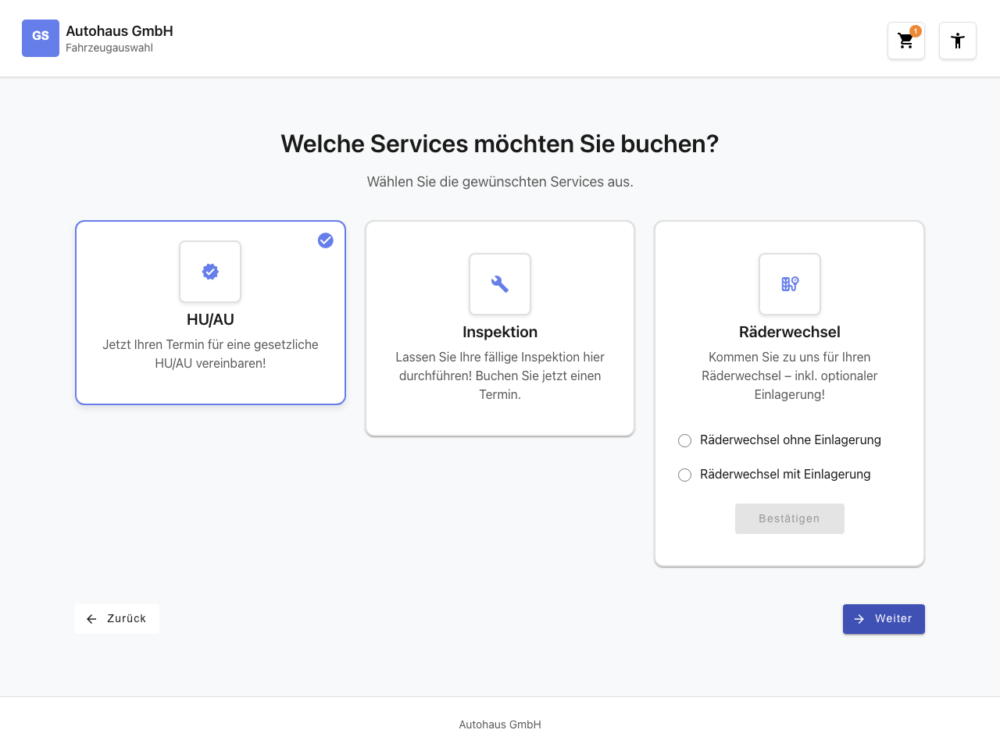
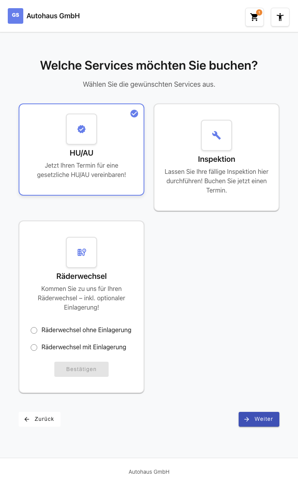
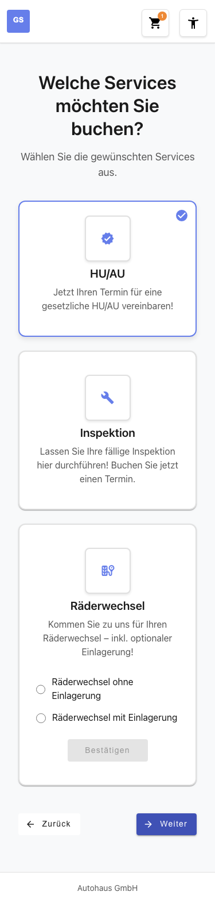

# Feature Documentation: Wizard State Sync (Backward Navigation)

**Created:** 2026-02-25
**Requirement:** REQ-007-WizardStateSync
**Language:** EN
**Status:** Implemented

---

## Overview

Wizard State Sync is a cross-cutting requirement that improves backward navigation in the booking wizard. When the user clicks the "Back" button in wizard steps 2 through 5, the respective store properties are reset (nulled) before navigation to the previous step occurs. This keeps the UI flow and store state consistently synchronized. The existing route guards (`brandSelectedGuard`, `locationSelectedGuard`, `servicesSelectedGuard`) check the store state and prevent users from accessing later wizard steps via direct URL when the required data is missing.

This feature does not create any new UI elements, pages, or components. It exclusively modifies the `onBack()` methods in existing container components and adds two new clear methods to the BookingStore.

---

## User Flow

### Step 1: Back from Appointment Selection (Step 5)

**Description:** The user is on the appointment selection page (`/home/appointment`) and clicks the "Back" button. The system sets `selectedAppointment` in the BookingStore to `null` (via `clearSelectedAppointment()`) and then navigates to the notes page (`/home/notes`). The selected appointment is removed from the cart dropdown.

### Step 2: Back from Notes (Step 4)

**Description:** The user is on the notes page (`/home/notes`) and clicks the "Back" button. The system sets `bookingNote` in the BookingStore to `null` (via `clearBookingNote()`) and navigates to the service selection (`/home/services`). The entered note is discarded.

### Step 3: Back from Service Selection (Step 3)

**Description:** The user is on the service selection page (`/home/services`) and clicks the "Back" button. The system clears `selectedServices` in the BookingStore (via `clearSelectedServices()` -- already implemented before REQ-007) and navigates to the location selection (`/home/location`). The selected services are removed from the cart, and the badge counter in the header decreases or disappears.

### Step 4: Back from Location Selection (Step 2)

**Description:** The user is on the location selection page (`/home/location`) and clicks the "Back" button. The system sets `selectedLocation` in the BookingStore to `null` (via `clearSelectedLocation()`) and navigates to the brand selection (`/home/brand`). The selected location is discarded.

### Step 5: Guard Protection on Direct URL After Backward Navigation

**Description:** After the user has navigated back through multiple steps (e.g., from step 5 to step 2), the corresponding store properties are `null`. If the user attempts to directly access a later wizard URL (e.g., `/home/notes` or `/home/appointment`), the existing guards check the store state in cascade. Since the required properties are missing, the user is automatically redirected to the earliest incomplete step.

### Step 6: Cart Update

**Description:** After each store reset, the cart in the header updates immediately. Nulled properties (services, appointment, note) disappear from the dropdown and the badge counter adjusts accordingly. Remaining, non-nulled properties (e.g., brand and location when navigating back from step 4) remain visible in the cart.

---

## Acceptance Criteria

| AC | Description | Status |
|----|-------------|--------|
| AC-1 | Clicking "Back" in appointment selection nulls `selectedAppointment` and navigates to `/home/notes` | Implemented |
| AC-2 | Clicking "Back" in notes nulls `bookingNote` and navigates to `/home/services` | Implemented |
| AC-3 | Clicking "Back" in service selection nulls `selectedServices` and navigates to `/home/location` (already implemented) | Implemented |
| AC-4 | Clicking "Back" in location selection nulls `selectedLocation` and navigates to `/home/brand` | Implemented |
| AC-5 | After backward navigation: direct URL access to later steps is correctly redirected by guards | Implemented |
| AC-6 | After complete backward navigation: direct access to `/home/notes` is redirected to the earliest missing step | Implemented |
| AC-7 | Forward navigation (`onContinue()`) remains unchanged -- no reset on continue click | Implemented |
| AC-8 | The cart in the header updates immediately after reset (badge and dropdown content) | Implemented |

---

## Responsive Views

### Desktop (1280x720)

After backward navigation, the wizard correctly displays the previous step. All store properties are synchronized, and the cart in the header reflects the current state.

### Tablet (768x1024)

On tablet, the wizard step layout remains consistent. The back buttons are touch-friendly sized and the state reset works identically to the desktop view.

### Mobile (375x667)

In the mobile view, the back buttons are displayed full-width with a minimum touch target size of 2.75em. The cart badge in the header updates immediately after the store reset.

---

## Accessibility

- **Keyboard Navigation:** The existing back buttons are reachable via Tab and activatable via Enter or Space. The store reset behavior is transparent to keyboard navigation.
- **Screen Reader:** No changes to ARIA attributes required. The back buttons retain their existing `aria-label` attributes.
- **Color Contrast:** WCAG 2.1 AA compliant -- no visual changes to the buttons.
- **Focus Styles:** Existing `:focus-visible` styles are preserved.

---

## Technical Details

| Property | Value |
|----------|-------|
| Route | N/A (Cross-Cutting, affects all wizard routes) |
| Container Components | `LocationSelectionContainerComponent`, `NotesContainerComponent`, `AppointmentSelectionContainerComponent` |
| Store | `BookingStore` (providedIn: 'root') |
| New Store Methods | `clearSelectedLocation()`, `clearBookingNote()` |
| Guards (unchanged) | `brandSelectedGuard`, `locationSelectedGuard`, `servicesSelectedGuard` |
| Change Detection | OnPush |

---

## Changed Files

| File | Change |
|------|--------|
| `booking.store.ts` | New methods `clearSelectedLocation()` and `clearBookingNote()` |
| `location-selection-container.component.ts` | `onBack()`: Calls `clearSelectedLocation()` before navigation |
| `notes-container.component.ts` | `onBack()`: Calls `clearBookingNote()` before navigation |
| `appointment-selection-container.component.ts` | `onBack()`: Calls `clearSelectedAppointment()` before navigation |

---

## Reset Matrix

| Wizard Step | onBack() in Component | Nulled Property | Store Method |
|-------------|-----------------------|-----------------|--------------|
| Step 2 (Location Selection) | `LocationSelectionContainerComponent.onBack()` | `selectedLocation` | `clearSelectedLocation()` |
| Step 3 (Service Selection) | `ServiceSelectionContainerComponent.onBack()` | `selectedServices` | `clearSelectedServices()` |
| Step 4 (Notes) | `NotesContainerComponent.onBack()` | `bookingNote` | `clearBookingNote()` |
| Step 5 (Appointment Selection) | `AppointmentSelectionContainerComponent.onBack()` | `selectedAppointment` | `clearSelectedAppointment()` |

---

## Business Rules

- **BR-1:** Every `onBack()` method nulls the store properties of the current step BEFORE navigation occurs.
- **BR-2:** Only the properties of the current step are nulled -- properties of previous steps remain preserved.
- **BR-3:** Forward navigation (`onContinue()`) is NOT modified.
- **BR-4:** Browser back button does not trigger a store reset -- only the explicit wizard back button does.
- **BR-5:** Store reset methods are idempotent -- multiple calls have no side effects.
- **BR-6:** Order in `onBack()`: 1. Store reset, 2. Navigation.
