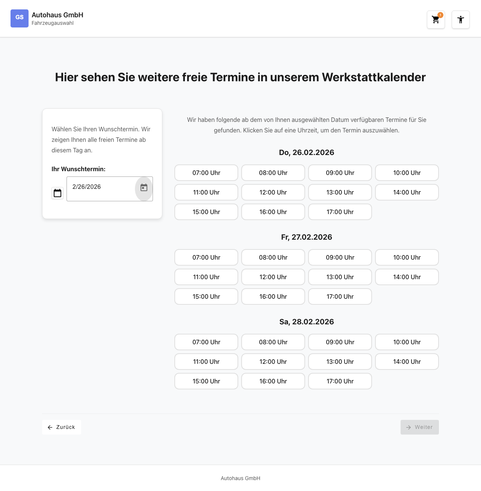
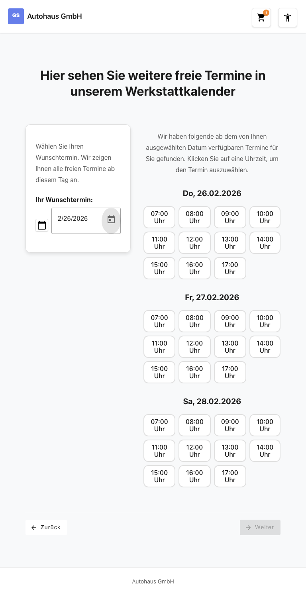
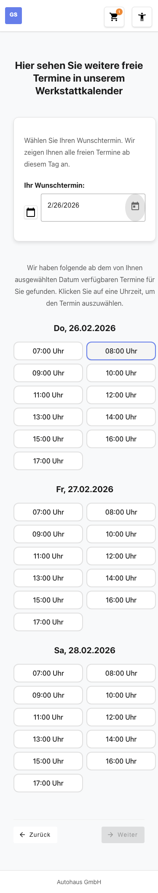

# Feature-Dokumentation: Werkstattkalender

**Erstellt:** 2026-02-26
**Requirement:** REQ-008-Werkstattkalender
**Sprache:** DE
**Status:** Implementiert

---

## Uebersicht

Der Werkstattkalender ermoeglicht es dem Benutzer, einen individuellen Wunschtermin fuer seinen Werkstattbesuch auszuwaehlen. Im Gegensatz zur Standard-Terminauswahl (REQ-006) bietet der Werkstattkalender eine freie Datumsauswahl ueber einen Kalender (DatePicker). Nach Auswahl eines Datums werden die naechsten 3 Werktage (Montag bis Samstag, kein Sonntag) mit jeweils 11 stuendlichen Uhrzeitslots (07:00 bis 17:00 Uhr) angezeigt. Der Benutzer kann einen einzelnen Uhrzeitslot auswaehlen und anschliessend zum naechsten Schritt im Buchungsprozess navigieren.

Die Seite ist erreichbar ueber den Link "Hier sehen Sie weitere freie Termine in unserem Werkstattkalender" auf der Terminauswahl-Seite (REQ-006).

---

## Benutzerfuehrung

### Schritt 1: Seite wird geladen

**Beschreibung:** Beim Laden der Seite sieht der Benutzer eine zweigeteilte Ansicht. Auf der linken Seite befindet sich eine Karte mit der Ueberschrift "Hier sehen Sie weitere freie Termine in unserem Werkstattkalender", einem Beschreibungstext "Waehlen Sie Ihren Wunschtermin. Wir zeigen Ihnen alle freien Termine ab diesem Tag an.", dem Label "Ihr Wunschtermin:" sowie einem leeren Eingabefeld mit dem Platzhalter "Wunschtermin waehlen" und einem Kalender-Icon. Auf der rechten Seite wird der Hinweistext "Waehlen Sie im Kalender einen gewuenschten Termin aus und wir zeigen Ihnen die naechsten verfuegbaren Termine" angezeigt. Noch sind keine Uhrzeitslots sichtbar.

### Schritt 2: Benutzer klickt auf das Eingabefeld

**Beschreibung:** Wenn der Benutzer auf das Eingabefeld "Wunschtermin waehlen" klickt, oeffnet sich ein Material DatePicker. Das aktuelle Datum ist als Mindestdatum gesetzt, sodass vergangene Tage nicht ausgewaehlt werden koennen. Der Benutzer kann alternativ ein Datum manuell im Format TT.MM.JJJJ eingeben.

### Schritt 3: Benutzer waehlt ein Datum

**Beschreibung:** Nach Auswahl eines Datums im DatePicker oder manueller Eingabe geschieht Folgendes:
- Das ausgewaehlte Datum erscheint im Eingabefeld.
- Der Text auf der rechten Seite wechselt zu: "Wir haben folgende ab dem von Ihnen ausgewaehlten Datum verfuegbaren Termine fuer Sie gefunden. Klicken Sie auf eine Uhrzeit, um den Termin auszuwaehlen."
- Das System berechnet die naechsten 3 Werktage (Mo-Sa, kein Sonntag) ab dem gewaehlten Datum.
- Fuer jeden Werktag werden 11 stuendliche Uhrzeitslots von 07:00 bis 17:00 Uhr angezeigt.
- Jeder Tagesblock hat eine Ueberschrift im Format "Mo, 02.03.2026".

### Schritt 4: Benutzer waehlt eine Uhrzeit

**Beschreibung:** Der Benutzer klickt auf einen der angezeigten Uhrzeitslots (z.B. "09:00 Uhr"). Der ausgewaehlte Slot wird visuell hervorgehoben (farbiger Rahmen und Hintergrund). Es kann immer nur ein Slot gleichzeitig ausgewaehlt sein (Single-Select, auch tagesuebergreifend). Nach der Auswahl wird der "Weiter"-Button aktiviert. Der gewaehlte Termin wird im BookingStore als `selectedAppointment` gespeichert.

### Schritt 5: Benutzer klickt "Weiter"

**Beschreibung:** Der aktivierte "Weiter"-Button navigiert zum naechsten Wizard-Schritt. Der "Zurueck"-Button fuehrt zurueck zur Terminauswahl-Seite (`/home/appointment`). Solange kein Uhrzeitslot gewaehlt ist, bleibt der "Weiter"-Button deaktiviert.

---

## Responsive Ansichten

### Desktop (1280x720)

Das Desktop-Layout zeigt eine zweispaltige Ansicht: links die Karte mit DatePicker, rechts die Uhrzeitslots. Das Uhrzeitslot-Grid wird in 4 Spalten dargestellt.

### Tablet (768x1024)

Im Tablet-Layout bleibt die zweispaltige Ansicht erhalten. Die linke Karte hat eine Breite von ca. 18em. Die Uhrzeitslots werden ebenfalls in 4 Spalten angezeigt.

### Mobile (375x667)

Im Mobile-Layout werden die beiden Bereiche einspaltig untereinander gestapelt. Die Uhrzeitslots werden in einem 2-spaltigen Grid dargestellt, um die Touch-Bedienbarkeit zu gewaehrleisten.

---

## Barrierefreiheit

- **Tastaturnavigation:** Alle Uhrzeitslots sind per Tab-Taste erreichbar und koennen mit Enter oder Leertaste ausgewaehlt werden. Der DatePicker ist vollstaendig per Tastatur bedienbar.
- **Screen Reader:** Der rechte Bereich mit den Uhrzeitslots verfuegt ueber `aria-live="polite"`, sodass Aenderungen des Inhalts (Wechsel von Hinweistext zu Uhrzeitslots) dem Screen Reader mitgeteilt werden. Jeder Tagesblock hat ein `aria-label` mit den verfuegbaren Uhrzeiten.
- **Farbkontrast:** WCAG 2.1 AA konform mit einem Mindestkontrastverhaeltnis von 4.5:1.
- **Focus-Styles:** Alle interaktiven Elemente zeigen einen deutlich sichtbaren Focus-Ring bei `:focus-visible`.
- **Touch-Targets:** Alle Uhrzeitslot-Buttons haben eine Mindestgroesse von 2.75em fuer komfortable Touch-Bedienung.

---

## Technische Details

| Eigenschaft | Wert |
|-------------|------|
| Route | `/#/home/workshop-calendar` |
| Container Component | `WorkshopCalendarContainerComponent` |
| Presentational Components | `WorkshopCalendarDatePickerComponent`, `WorkshopCalendarDayComponent` |
| Store | `BookingStore` (erweitert um `workshopCalendarDate`, `workshopCalendarDays`) |
| API Service | `WorkshopCalendarApiService` |
| Guard | `servicesSelectedGuard` |
| Models | `WorkshopTimeSlot`, `WorkshopCalendarDay`, `WorkshopCalendarViewState` |
