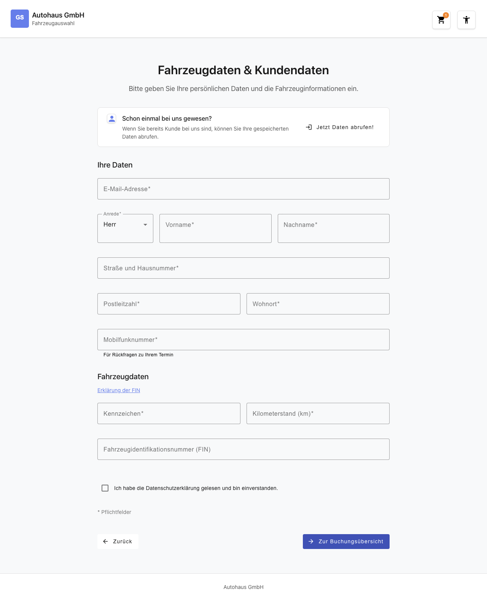
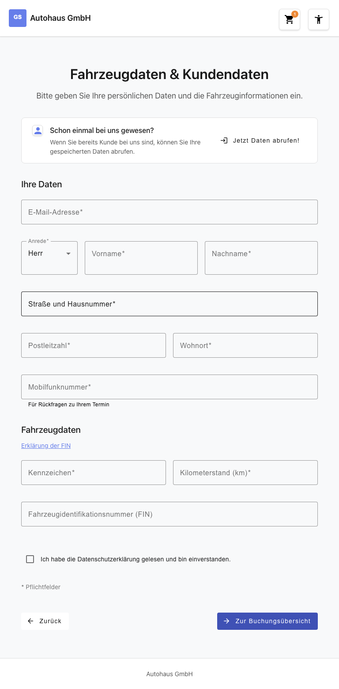
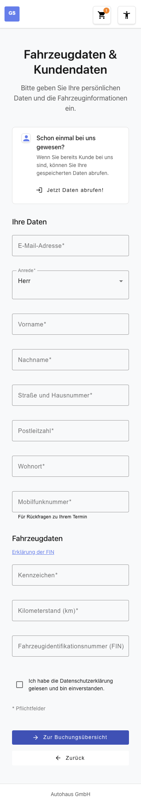

# Feature Documentation: Customer Data & Vehicle Information (REQ-009)

**Created:** 2026-03-05
**Requirement:** REQ-009-carinformation
**Language:** EN
**Status:** Implemented

---

## Overview

The "Customer Data & Vehicle Information" feature is step 6 of 8 in the booking wizard for the online appointment scheduling system at Gottfried Schultz. The user enters their personal contact data and vehicle-related information here before being forwarded to the booking summary.

The page consists of a returning-customer banner ("Been with us before?"), two form sections (customer data and vehicle data), a GDPR consent checkbox, and navigation buttons for going back and proceeding to the booking overview.

---

## User Flow

### Step 1: Page Load

**Description:** The user arrives from step 5 (appointment selection, REQ-006, or workshop calendar REQ-008). The `carInformationGuard` verifies that all required store fields are present (brand, location, services, appointment). If any of these fields is missing, the user is automatically redirected to the corresponding wizard step. When all preconditions are met, the page is displayed with an empty form — or with pre-filled values if the user has visited the page before.

### Step 2: Fill in Customer Data

**Description:** The user fills in the required fields of the "Customer Data" section: email address, salutation (dropdown: Mr. / Ms.), first name, last name, street and house number, postal code, city, and mobile phone number. Error messages appear inline directly below the respective field as soon as the field loses focus (on-blur validation).

### Step 3: Fill in Vehicle Data

**Description:** The user enters the license plate, mileage, and VIN (Vehicle Identification Number). Next to the VIN field there is an info link "Explanation of VIN" (click-dummy placeholder). All vehicle fields are required and subject to format validation.

### Step 4: Accept GDPR Consent

**Description:** The user checks the GDPR consent checkbox. The label text contains a link to the privacy policy. The form can only be submitted once the checkbox is checked — without it, an error message appears.

### Step 5: Submit the Form

**Description:** The user clicks the primary button "To Booking Overview". The system validates all fields in full (markAllAsTouched). On success, `customerInfo`, `vehicleInfo`, and `privacyConsent` are saved to the BookingStore and the user is navigated to the booking overview. If there are validation errors, the user remains on the page; all invalid fields are highlighted with inline error messages.

---

## Responsive Views

### Desktop (1280x720)


On desktop, multi-column rows are used: Salutation / First Name / Last Name (25% / 37.5% / 37.5%), Postal Code / City (30% / 70%), and License Plate / Mileage (50% / 50%). The banner spans the full width.

### Tablet (768x1024)


On tablet (>= 48em), the multi-column layout is preserved. Spacing and font sizes are adjusted slightly.

### Mobile (375x667)


On mobile (< 48em), all rows are single-column. Salutation, first name, and last name are stacked vertically. Touch targets have a minimum size of 2.75em (44px).

---

## Accessibility

- **Keyboard Navigation:** All form fields are reachable via Tab. The order follows the visual form flow (Email -> Salutation -> First Name -> ... -> VIN -> Checkbox -> Back -> Continue).
- **Screen Reader:** All inputs have `<label for="">` and `id` attributes. Required fields are marked with `aria-required="true"`. Error messages are linked to their fields via `aria-describedby`. The GDPR error message has `role="alert"` for immediate announcement.
- **Color Contrast:** WCAG 2.1 AA compliant (minimum contrast ratio 4.5:1).
- **Focus Styles:** Visible `:focus-visible` styles on all interactive elements.
- **Icons:** All icons have `aria-hidden="true"` and an `.icon-framed` wrapper.

---

## Validation Rules

| Field | Validation | Error Message |
|-------|-----------|---------------|
| Email Address | Required, valid email format | "Please enter a valid email address." |
| Salutation | Required (options: Mr. / Ms.) | "Please select a salutation." |
| First Name | Required, Unicode letters only incl. umlauts, spaces, hyphens | "First name may only contain letters." |
| Last Name | Required, Unicode letters only incl. umlauts, spaces, hyphens | "Last name may only contain letters." |
| Street and House Number | Required, free text | "Please enter your street and house number." |
| Postal Code | Required, exactly 5 digits (`^\d{5}$`) | "Postal code may only contain digits." |
| City | Required, letters only incl. umlauts, spaces, hyphens | "City may only contain letters." |
| Mobile Phone Number | Required, digits only, must start with `0` (`^0[0-9]+$`) | "Mobile number must start with 0." |
| License Plate | Required, format `^[A-ZÄÖÜ]{1,3}-[A-Z]{1,2}\d{1,4}$` | "Please enter a valid license plate (e.g. B-MS1234)." |
| Mileage | Required, digits only, min. 0 | "Mileage may only contain digits." |
| VIN | Optional, exactly 17 alphanumeric characters (`^[A-HJ-NPR-Z0-9]{17}$`) | "The VIN must be exactly 17 characters." |
| GDPR Consent | Required (`requiredTrue`) | "Please accept the privacy policy." |

---

## Guard Behavior

The `carInformationGuard` (Functional Guard, `CanActivateFn`) protects the route `/#/home/carinformation`. It checks the following store fields sequentially:

| Check | If missing: Redirect to |
|-------|-------------------------|
| `hasBrandSelected()` | `/#/home/brand` |
| `hasLocationSelected()` | `/#/home/location` |
| `hasServicesSelected()` | `/#/home/services` |
| `hasAppointmentSelected()` | `/#/home/appointment` |

A direct URL call to the route without all prior wizard steps completed is therefore blocked. The guard automatically redirects the user to the first missing step.

---

## Alternative Flows

### Back Navigation

Clicking the "Back" button clears `selectedAppointment` in the BookingStore (as per REQ-007 WizardStateSync) and navigates to `/home/appointment`. If the user arrived via the workshop calendar (REQ-008), navigation goes to `/home/workshop-calendar` instead.

### Returning Customer Banner (Click-Dummy)

The "Been with us before?" banner displays a "Retrieve my data!" button. A click registers the event (debug log) but has no further effect — the automatic data retrieval is implemented as a click-dummy placeholder (future production feature).

### VIN Info Link (Click-Dummy)

The "Explanation of VIN" link next to the VIN input field is a click-dummy placeholder (`href="#"`). Clicking it only produces a debug log entry.

---

## Technical Details

| Property | Value |
|----------|-------|
| Route | `/#/home/carinformation` |
| Container Component | `CarinformationContainerComponent` |
| Customer Form Component | `CustomerFormComponent` |
| Vehicle Form Component | `VehicleFormComponent` |
| Guard | `carInformationGuard` (Functional Guard) |
| Store | `BookingStore` (NgRx Signal Store) |
| State Extension | `customerInfo: CustomerInfo \| null`, `vehicleInfo: VehicleInfo \| null`, `privacyConsent: boolean` |
| Change Detection | `OnPush` (all components) |
| Form Handling | Angular Reactive Forms (no ngModel) |
| i18n Keys | `booking.carinformation.*` |

### Store Methods (BookingStore Extension)

```typescript
setCustomerInfo(info: CustomerInfo): void
setVehicleInfo(info: VehicleInfo): void
setPrivacyConsent(consent: boolean): void
clearCarInformation(): void
```

### Data Model

```typescript
// src/app/features/booking/models/customer.model.ts

export type Salutation = 'mr' | 'ms';

export interface CustomerInfo {
  email: string;
  salutation: Salutation;
  firstName: string;
  lastName: string;
  street: string;
  postalCode: string;
  city: string;
  mobilePhone: string;
}

export interface VehicleInfo {
  licensePlate: string;
  mileage: number;
  vin: string;
}
```
