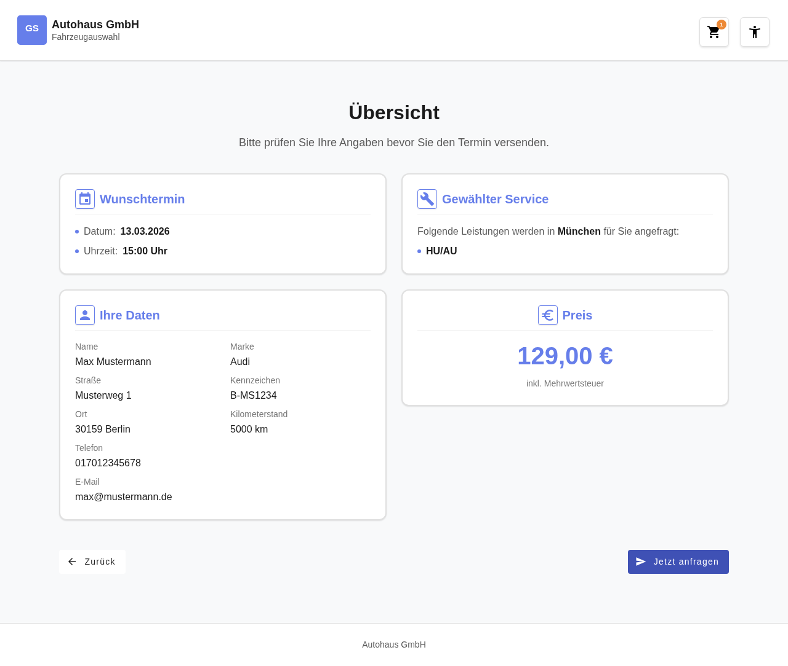
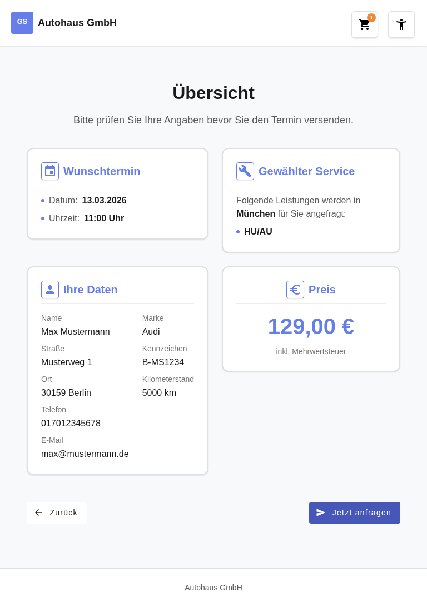
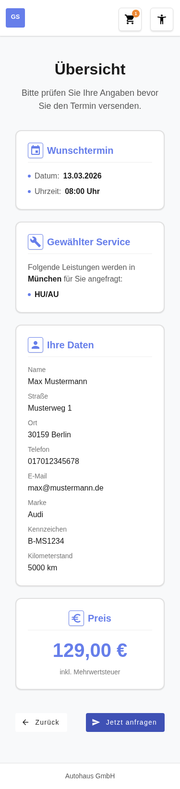

# Feature-Dokumentation: Buchungsübersicht

**Erstellt:** 2026-03-09
**Requirement:** REQ-010-Buchungsübersicht
**Sprache:** DE
**Status:** Implementiert

---

## Übersicht

Die Buchungsübersicht ist der letzte Schritt im Buchungs-Wizard der Online-Terminvereinbarung. Der Benutzer erhält eine strukturierte, schreibgeschützte Zusammenfassung aller im Wizard gemachten Eingaben, bevor er die Buchungsanfrage endgültig absendet. Die Seite zeigt vier Kacheln — Wunschtermin, Gewählter Service, Persönliche Daten und Preis — in einem übersichtlichen 2×2-Grid (Desktop) bzw. einspaltig gestapelt (Mobile). Der Benutzer kann seine Angaben prüfen und entweder zurücknavigieren oder die Buchung absenden.

### User Story

**Als** Kunde
**möchte ich** vor dem Absenden meiner Buchungsanfrage alle meine gemachten Angaben übersichtlich prüfen können,
**damit** ich sichergehen kann, dass alle Daten korrekt sind, bevor der Termin angefragt wird.

---

## Benutzerführung

### Schritt 1: Seite wird geladen — Guard-Prüfung

**Beschreibung:** Beim Aufruf der Route `/home/booking-overview` prüft der `bookingOverviewGuard` automatisch alle 7 Pflichtfelder im BookingStore (Marke, Standort, Services, Termin, Kundendaten, Fahrzeugdaten, Datenschutzeinwilligung). Nur wenn alle Felder vollständig befüllt sind, wird die Seite angezeigt. Bei fehlenden Daten erfolgt ein automatischer Redirect zu `/home`.

Nach erfolgreicher Prüfung zeigt die Seite:
- **Seitenüberschrift:** „Übersicht"
- **Untertext:** „Bitte prüfen Sie Ihre Angaben bevor Sie den Termin versenden."
- **4 Kacheln** mit allen Store-Daten befüllt
- **Navigationsleiste** mit „Zurück"- und „Jetzt anfragen"-Button

### Schritt 2: Benutzer prüft seine Angaben

**Beschreibung:** Der Benutzer liest die vier Kacheln und prüft Wunschtermin, gewählte Services, persönliche Daten und den Gesamtpreis. Alle Daten werden schreibgeschützt (read-only) aus dem BookingStore angezeigt — keine Eingabe oder Bearbeitung ist möglich.

| Kachel | Angezeigte Informationen |
|--------|--------------------------|
| **Wunschtermin** | Datum (z.B. „15.04.2026") und Uhrzeit (z.B. „10:00 Uhr") |
| **Gewählter Service** | Alle gewählten Services mit Varianten (z.B. „Räderwechsel — mit Einlagerung") |
| **Persönliche Daten** | Name, Straße, PLZ + Ort, Telefon, E-Mail, Marke, Kennzeichen, Kilometerstand |
| **Preis** | Gesamtpreis inkl. MwSt. (statischer Click-Dummy-Wert: € 89,00) |

### Schritt 3: Benutzer klickt „Zurück"

**Beschreibung:** Der sekundäre „Zurück"-Button (links in der Navigationsleiste) navigiert zurück zur carinformation-Seite (`/home/carinformation`). Alle Store-Daten bleiben unverändert erhalten, sodass der Benutzer seine Angaben korrigieren und anschließend wieder zur Übersicht zurückkehren kann.

### Schritt 4: Benutzer klickt „Jetzt anfragen"

**Beschreibung:** Der primäre „Jetzt anfragen"-Button (rechts in der Navigationsleiste) löst den simulierten Buchungsabschluss aus. Das System setzt `BookingStore.bookingSubmitted = true` und navigiert zur Buchungsabschluss-Seite. Da es sich um einen Click-Dummy handelt, findet kein HTTP-Request statt.

---

## Responsive Ansichten

### Desktop (≥ 48em / 768px)

Die vier Kacheln werden in einem **2×2-Grid** dargestellt:
- Oben links: Wunschtermin
- Oben rechts: Gewählter Service
- Unten links: Persönliche Daten
- Unten rechts: Preis

Die Navigationsleiste zeigt den Zurück-Button links und den Jetzt-anfragen-Button rechts (`justify-content: space-between`).



### Tablet (≥ 48em / 768px)

Das Layout entspricht der Desktop-Ansicht mit 2-Spalten-Grid. Die Kacheln passen sich der verfügbaren Breite an.



### Mobile (< 48em / 768px)

Alle Kacheln werden **einspaltig gestapelt** dargestellt. Die Reihenfolge bleibt erhalten: Wunschtermin → Gewählter Service → Persönliche Daten → Preis. Die Navigations-Buttons stehen nebeneinander.



---

## Barrierefreiheit

- **Tastaturnavigation:** Alle interaktiven Elemente (Zurück-Button, Jetzt-anfragen-Button) sind per Tab erreichbar. Logische Tab-Reihenfolge folgt dem visuellen Layout.
- **Screen Reader:** Seitenüberschrift als `<h1>`, Kacheltitel als `<h2>`. Jede Kachel ist als `<article>` mit `aria-labelledby` ausgezeichnet. Das Grid hat `role="region"` mit `aria-label="booking summary"`. Navigationsleiste hat `aria-label="page navigation"`.
- **Farbkontrast:** WCAG 2.1 AA konform — Kontrastverhältnis ≥ 4.5:1 für alle Texte.
- **Focus-Styles:** Sichtbare `:focus-visible` Outlines auf allen Buttons mit `outline: 0.1875em solid var(--color-focus-ring)`.
- **Touch-Targets:** Alle Buttons haben eine Mindesthöhe von `var(--touch-target-min)` (2.75em / 44px).
- **Aria-Labels:** Beide Navigations-Buttons besitzen `[attr.aria-label]` mit übersetztem Text. Icons sind mit `aria-hidden="true"` markiert.

---

## Technische Details

| Eigenschaft | Wert |
|-------------|------|
| Route | `/#/home/booking-overview` |
| Container Component | `BookingOverviewContainerComponent` |
| Store | `BookingStore` (NgRx Signal Store, `providedIn: 'root'`) |
| Guard | `bookingOverviewGuard` (Functional `CanActivateFn`) |
| Change Detection | `OnPush` |
| Lazy Loading | Ja — `loadComponent()` in `booking.routes.ts` |

### Architektur

Das Feature folgt dem **Container/Presentational-Pattern**:

```
BookingOverviewContainerComponent (Container)
├── AppointmentTileComponent      (Presentational — input: appointment)
├── ServicesTileComponent         (Presentational — input: services, serviceLabels, locationName)
├── PersonalDataTileComponent     (Presentational — input: customerInfo, vehicleInfo, brandName)
└── PriceTileComponent            (Presentational — input: totalPriceGross)
```

**Container-Component** (`booking-overview-container.component.ts`):
- Injiziert `BookingStore`, `Router` und `TranslateService`
- Stellt 4 Computed Signals bereit: `resolvedBrandName`, `resolvedLocationName`, `resolvedServiceLabels`, `staticTotalPrice`
- Enthält zwei Methoden: `onSubmit()` (Buchung absenden) und `onBack()` (zurück navigieren)

**Presentational Components** (4 Kacheln):
- Empfangen Daten ausschließlich über `input()` Signals
- Kein `inject()` — keine eigene Logik
- `ChangeDetection.OnPush` durchgehend

### Datenfluss

```
BookingStore (globaler State)
    ↓ inject()
BookingOverviewContainerComponent
    ↓ computed() Signals
    ├── appointment → AppointmentTileComponent
    ├── services + resolvedServiceLabels + resolvedLocationName → ServicesTileComponent
    ├── customerInfo + vehicleInfo + resolvedBrandName → PersonalDataTileComponent
    └── staticTotalPrice → PriceTileComponent
```

### Guard-Logik

Der `bookingOverviewGuard` prüft alle 7 Pflichtfelder:

| Feld | Typ | Quelle |
|------|-----|--------|
| `selectedBrand` | `Brand` | REQ-002 |
| `selectedLocation` | `LocationDisplay` | REQ-003 |
| `selectedServices` | `SelectedService[]` (≥ 1) | REQ-004 |
| `selectedAppointment` | `AppointmentSlot` | REQ-006 |
| `customerInfo` | `CustomerInfo` | REQ-009 |
| `vehicleInfo` | `VehicleInfo` | REQ-009 |
| `privacyConsent` | `boolean` (`=== true`) | REQ-009 |

Bei fehlendem Feld: Redirect zu `/home` via `router.createUrlTree(['/home'])`.

### Material Components

- `MatCard`-ähnliches Layout für jede Kachel (custom `.summary-card` mit Surface-Background)
- `MatButton` (`mat-flat-button`) für beide Navigations-Buttons
- `MatIcon` mit `.icon-framed` für Kachel-Header-Icons (event, build, person, euro)

### Dateistruktur

```
src/app/features/booking/
├── guards/
│   └── booking-overview.guard.ts
├── stores/
│   └── booking.store.ts                    # bookingSubmitted, submitBooking(), isBookingComplete
├── components/
│   └── booking-overview/
│       ├── booking-overview-container.component.ts
│       ├── booking-overview-container.component.html
│       ├── booking-overview-container.component.scss
│       └── components/
│           ├── appointment-tile/
│           │   ├── appointment-tile.component.ts
│           │   ├── appointment-tile.component.html
│           │   └── appointment-tile.component.scss
│           ├── services-tile/
│           │   ├── services-tile.component.ts
│           │   ├── services-tile.component.html
│           │   └── services-tile.component.scss
│           ├── personal-data-tile/
│           │   ├── personal-data-tile.component.ts
│           │   ├── personal-data-tile.component.html
│           │   └── personal-data-tile.component.scss
│           └── price-tile/
│               ├── price-tile.component.ts
│               ├── price-tile.component.html
│               └── price-tile.component.scss
└── booking.routes.ts
```
