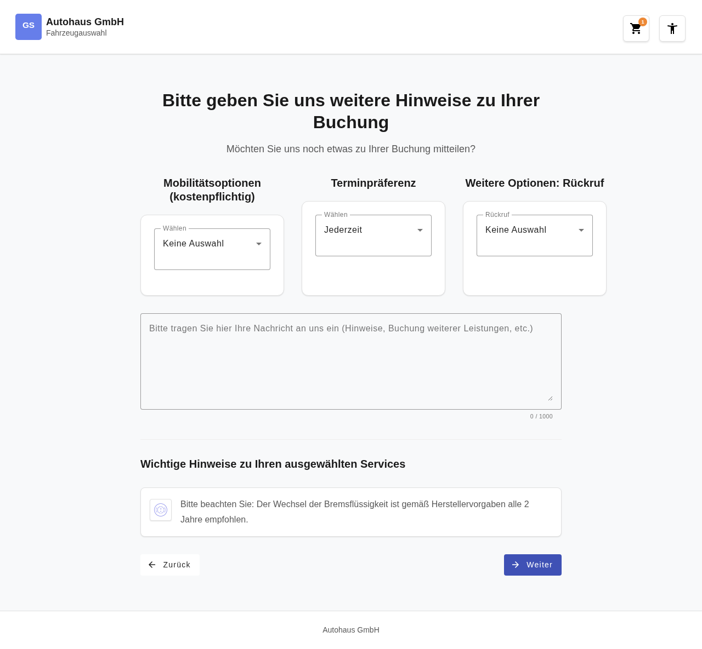
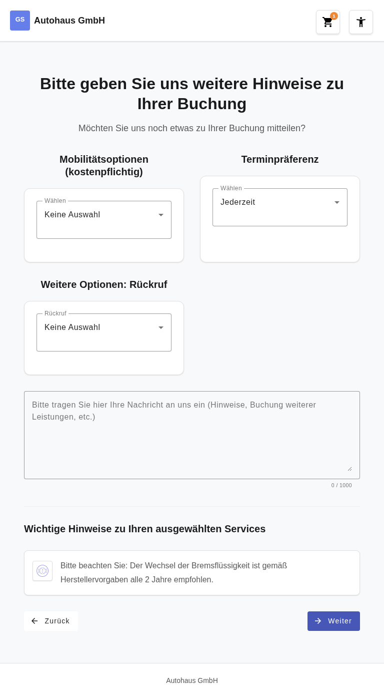
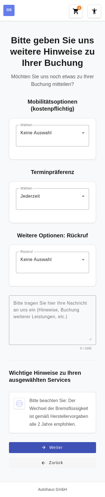

# Feature Documentation: Extended Notes Page

**Created:** 2026-04-02
**Requirement:** REQ-012-Hinweisseite-Erweitert
**Language:** EN
**Status:** Implemented

---

## Overview

The notes page (wizard step 4) has been extended with three additional selection fields:
- **Mobility Options (chargeable):** Selection of a replacement vehicle (Compact car, Mid-range, Luxury)
- **Appointment Preference:** Preferred time of day for the workshop appointment
- **Callback:** Request for a phone callback

These options appear above the existing notes textarea.

---

## User Guide

### Step 1: Open the Notes Page

**Description:** After selecting brand, location, and services, the user arrives at the notes page. The three new dropdown fields are immediately visible.

### Step 2: Select Mobility Option
**Description:** In the first dropdown, the user can select a replacement vehicle:
- No selection (default)
- Compact car
- Mid-range
- Luxury

### Step 3: Select Appointment Preference
**Description:** In the second dropdown, the user sets their preferred time of day:
- Anytime (default)
- Morning
- Afternoon

### Step 4: Select Callback Option
**Description:** In the third dropdown, the user can request a callback:
- No selection (default)
- Yes

### Step 5: Enter Notes (optional)
**Description:** The existing text field for free-form notes remains available.

### Step 6: Click Continue
**Description:** All dropdown values are saved. The user proceeds to the next wizard step.

---

## Responsive Views

### Desktop (1280x720)

### Tablet (768x1024)

### Mobile (375x667)

---

## Accessibility

- **Keyboard Navigation:** All dropdowns are reachable via Tab and operable via Enter/Space
- **Screen Reader:** ARIA labels and roles correctly set (`role="group"`, `role="region"`)
- **Color Contrast:** WCAG 2.1 AA compliant (≥ 4.5:1)
- **Focus Styles:** Visible focus rings via `:focus-visible`
- **Touch Targets:** Minimum size 2.75em for mobile interaction

---

## Technical Details

| Property | Value |
|----------|-------|
| Route | `/#/home/notes` |
| Container Component | `NotesContainerComponent` |
| Presentational Component | `NotesExtrasFormComponent` |
| Store | `BookingStore` |
| Model | `NotesExtras` (notes-extras.model.ts) |
| i18n Keys | `booking.notes.mobilityOptions.*`, `booking.notes.appointmentPreference.*`, `booking.notes.callback.*` |
